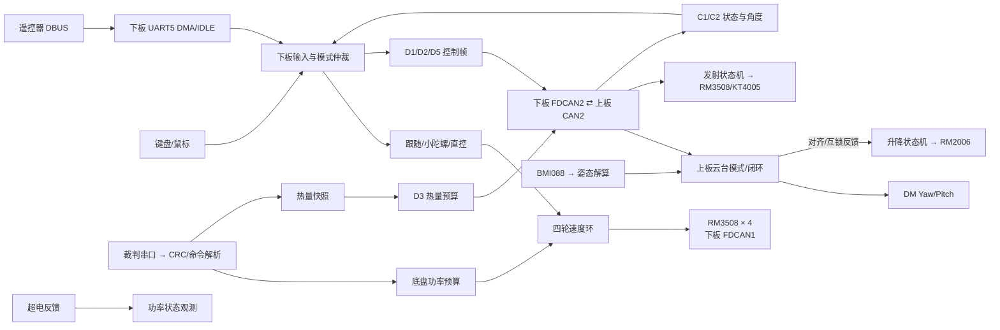

# RoboMaster 双板控制固件

面向 RoboMaster 机器人控制的 STM32 双板固件：上板运行云台、IMU、升降和发射闭环，下板运行遥控输入、四轮底盘及板间调度。

## 项目讲解与源码速查

本节按当前工作区源码整理，适合项目介绍、答辩和复习。参数是代码默认值；运行时的 `gimbal_tune`、`lift_tune` 等调参对象可能被人工修改。功能路径已做源码核对，控制效果、功率精度和机构可靠性仍需人工实机验证。

快速跳转：[技术要点](#技术要点做什么怎样实现代码在哪里) · [动作与源码](#按一个动作追完整代码链) · [底盘算法](#底盘算法怎样讲) · [云台算法](#云台算法怎样讲) · [升降与发射](#升降与发射状态机怎样讲) · [功率与热量](#功率和热量怎样讲) · [参数速查](#关键参数速查数值单位和作用) · [常见追问](#常见追问与回答边界) · [构建入口](#getting-started)

### 一分钟介绍

> 这个项目是一套基于 FreeRTOS 的 RoboMaster 双板控制固件。下板使用 STM32H723，负责接收遥控器和键鼠输入、控制四个底盘电机、解析裁判数据，并管理底盘功率预算；上板使用 STM32F407，负责 BMI088 姿态解算、两轴云台、升降机构和发射机构。两板通过经典 CAN 交换指令、角度和设备状态。软件按配置、设备、驱动、算法、协议、模块和任务分层：底盘把平移和旋转指令分配成四轮速度，云台把位置或角速度目标闭环转换成力矩，升降和拨盘则用状态机组织动作。工程重点是控制闭环、上下板协同，以及通信失联、热量不足和功率不足时的输出约束。

建议展开顺序：**双板分工 → 输入与任务 → 云台/底盘闭环 → 升降/发射状态机 → 热量/功率限制 → CAN 协议与保护**。

### 技术要点：做什么、怎样实现、代码在哪里

| 技术要点 | 讲解重点 | 当前实现与源码入口 |
| --- | --- | --- |
| 双 MCU 分工与软件分层 | 将输入/底盘和姿态/执行机构分配到两板，通过协议对象交换数据 | 两板 [main.c](task_up/Core/Src/main.c)、[下板 main.c](task_down/Core/Src/main.c) 启动；`Application/TaskLayer` 调用业务模块，`ConfigLayer` 保存主要参数 |
| FreeRTOS 任务调度 | 控制、输入、监控和通信各有任务；周期和优先级决定何时更新数据 | [上板任务创建](task_up/Core/Src/freertos.c)、[下板任务创建](task_down/Core/Src/freertos.c)；上板用 `osDelayUntil` 对齐 1 ms，下板用 `osDelay(1)` |
| 遥控与键鼠仲裁 | 先判断输入在线和控制来源，再生成统一底盘指令；档位/按键决定跟随、机械或小陀螺 | [chassis_input.c](task_down/Application/ModuleLayer/chassis_input.c)：`Chassis_Input_Update()`、`Chassis_Input_Keyboard()`；[rc_protocol.c](task_down/Application/ProtocolLayer/rc_protocol.c) 解析 DBUS 和按键状态 |
| IMU 姿态解算 | 陀螺仪给出旋转信息，加速度计提供重力方向约束；四元数 EKF 融合后得到姿态 | [imu_sensor.c](task_up/Application/DeviceLayer/Sensor/imu_sensor.c)：`imu_update()`；[bmi_EKF.c](task_up/Application/DeviceLayer/Imu/bmi_EKF.c)；`IMU_USE_EKF=1`、`IMU_USE_MAHONY=0` |
| 云台闭环与补偿 | 区分机械位置定位、角速度控制和松杆保持；Pitch 叠加重力补偿，最终限矩 | [gimbal.c](task_up/Application/ModuleLayer/gimbal.c)：`gimbal_select_mode()`、`gimbal_update_rate_targets()`、`gimbal_mec_yaw_calc()`、`gimbal_calc_output()` |
| 四轮速度分配 | 将前后、左右、旋转三个分量组合成四轮目标，再用各轮反馈闭环修正 | [chassis_control.c](task_down/Application/ModuleLayer/chassis_control.c)：`Chassis_Control_KinematicsInverse()`、`Chassis_Control_PidUpdate()`；当前速度环为纯 P |
| 底盘跟随与坐标变换 | 跟随使用云台相对底盘角度；平移坐标变换保证云台转动时操作方向仍按云台坐标解释 | [chassis_follow.c](task_down/Application/ModuleLayer/chassis_follow.c)：`Chassis_Follow_Update()`；[chassis_spin.c](task_down/Application/ModuleLayer/chassis_spin.c) 处理小陀螺 |
| 升降状态机 | 先建立顶部零点，再按编码器目标控制升降；下行对齐、超时、越程和无进展检查各有分支 | [lift.c](task_up/Application/ModuleLayer/lift.c)：`Lift_Work()`、`lift_homing_up_update()`、`lift_move_update()` |
| 单发与连发 | 单发通过累加编码器位置目标完成一步供弹；连发使用独立速度环，停止后制动并保持位置 | [launch.c](task_down/Application/ModuleLayer/launch.c) 生成模式/触发；[launcher.c](task_up/Application/ModuleLayer/launcher.c)：`Launcher_DialUpdate()` |
| 裁判数据与热量预算 | CRC 校验后的热量上限、热量和冷却率经 D3 转发；上板估计本地热量并决定能否发射、发多快 | [judge_protocol.c](task_down/Application/ProtocolLayer/judge_protocol.c) → `Board_Tx_Pkt_03()` → `Launcher_HeatUpdate()` / `Launcher_HeatRefreshRate()` |
| 模型功率限制 | 裁判上限和缓冲能量决定预算；电流/转速模型估算四轮功率，以公共比例缩小力矩 | [power_limit.c](task_down/Application/AlgorithmLayer/power_limit.c)：`Power_Limit_GetTarget()`、`Power_Limit_Apply()` |
| 定点 CAN 协议和发送调度 | 8 字节帧容纳位域和定点数；控制帧成组检查 FIFO，反馈按周期发送 | [board_protocol.c](task_down/Application/ProtocolLayer/board_protocol.c) ↔ [communicate.c](task_up/Application/ProtocolLayer/communicate.c)；[connect_task.c](task_down/Application/TaskLayer/connect_task.c) 调度发送 |

### 按一个动作追完整代码链

| 要讲的动作 | 按顺序打开的文件与函数 | 最后观察什么 |
| --- | --- | --- |
| 摇杆/键盘让底盘移动 | [Command_Task.c](task_down/Application/TaskLayer/Command_Task.c) → [chassis_input.c](task_down/Application/ModuleLayer/chassis_input.c) `Chassis_Input_Update()` → [control_task.c](task_down/Application/TaskLayer/control_task.c) `StartCtrlTask()` → [chassis_control.c](task_down/Application/ModuleLayer/chassis_control.c) `Chassis_Control_Update()` | `chassis_input_cmd`、`wheel_target[]`、`wheel_speed[]`、`wheel_torque_out[]` |
| 鼠标让云台转动 | [board_protocol.c](task_down/Application/ProtocolLayer/board_protocol.c) `Board_Tx_Pkt_05()` → [connect_task.c](task_down/Application/TaskLayer/connect_task.c) → [communicate.c](task_up/Application/ProtocolLayer/communicate.c) → [gimbal.c](task_up/Application/ModuleLayer/gimbal.c) `gimbal_manual_input_update()` / `Gimbal_Work()` | D5 来源/类型/有效位、角速度目标、IMU/电机反馈、最终力矩 |
| 底盘跟随云台 | [communicate.c](task_up/Application/ProtocolLayer/communicate.c) `Send_To_Down_Board()` → [board_protocol.c](task_down/Application/ProtocolLayer/board_protocol.c) `Board_Rx_Meg_02()` → [chassis_follow.c](task_down/Application/ModuleLayer/chassis_follow.c) `Chassis_Follow_Update()` → 四轮闭环 | C2 机械 Yaw、`yaw_error_rad`、`wz_output`、反馈时间戳 |
| 按 B 进入过洞 | [下板 control_task.c](task_down/Application/TaskLayer/control_task.c) `Board_Debug_Hole_Command()` → D1 → [lift.c](task_up/Application/ModuleLayer/lift.c) `Lift_Work()`；[module.c](task_up/Application/ModuleLayer/module.c) 每轮先运行云台再运行升降 | `board_hole_request`、`lift.state/home_valid`、对齐条件、编码器目标/反馈 |
| 点鼠标发一发 | [launch.c](task_down/Application/ModuleLayer/launch.c) `Launch_Data_Update()` → D1 → [launcher.c](task_up/Application/ModuleLayer/launcher.c) `Launcher_Work()` / `Launcher_DialUpdate()` | `shoot_level` 上升沿、`feed_allowed`、热量预算、`accepted_count/completed_count/reject_reason` |
| 裁判功率不足时减小输出 | [judge_protocol.c](task_down/Application/ProtocolLayer/judge_protocol.c) → [chassis_control.c](task_down/Application/ModuleLayer/chassis_control.c) → [power_limit.c](task_down/Application/AlgorithmLayer/power_limit.c) | 裁判快照有效性、`target_power`、`requested_power`、`scale` |

### 底盘算法怎样讲

1. **输入统一**：遥控/键鼠先转成 `chassis_cmd_t` 中的 `vx/vy/wz`、来源和有效位。当前三个量按工程控制域使用，不可把 `25` 直接介绍成 `25 m/s`。
2. **跟随误差**：`yaw_error = wrapPi(yaw_relative - center)`，把误差归一到 ±π；前后掉头会改变跟随中心，平移旋转仍使用实际相对角。
3. **旋转目标**：比例纠偏叠加摩擦补偿、操作角速度前馈和特定恢复阶段的辅助前馈，再做方向/幅值、接管融合和斜坡限制。普通纠偏停止/恢复门槛为 1°/2°，采用滞回避免边界反复启停。
4. **平移坐标转换**：`vx' = cos(yaw)·vx - sin(yaw)·vy`，`vy' = sin(yaw)·vx + cos(yaw)·vy`，随后按配置方向系数输出。这样云台朝向改变时，操作者的平移输入仍可按云台方向解释。
5. **四轮分配**：左前 `-vx+vy+wz`，左后 `-vx-vy+wz`，右前 `vx+vy+wz`，右后 `vx-vy+wz`。当前实现直接在控制域组合；`chassis_config.h` 中的几何尺寸未在该函数中用于标准 SI 运动学换算。
6. **轮速闭环**：每轮比较目标与反馈，当前 `KP=0.8`、`KI=KD=0`；按模式限矩后再应用共同功率比例。任意一轮离线则停止四轮输出。

源码重点：[chassis_follow.c](task_down/Application/ModuleLayer/chassis_follow.c)、[chassis_control.c](task_down/Application/ModuleLayer/chassis_control.c)。

### 云台算法怎样讲

- **姿态与机械角分工**：IMU 提供姿态/角速度，电机反馈提供相对机构的机械角/速度。机械 Yaw 位置环使用编码器计数域，速度内环使用 IMU 的 deg/s；不能把不同环的 PID 数值直接比较。
- **状态选择**：失能/断联进入 `G_SLEEP`；恢复后先 `G_INIT`，完成初始化后依据 D1 进入 `G_MEC` 或 `G_RATE`。`G_GYRO/G_AUTO` 虽有分支，当前选择函数不会主动选择。
- **机械 Yaw**：最短角误差 → 软死区 → 计数域位置 PID → 目标角速度 → IMU 速度 PID → 力矩。靠近目标时用制动曲线和近端速度限制收敛。
- **底盘旋转补偿**：由 IMU 角速度与电机相对角速度之差估计底盘旋转速率，滤波后按幅值渐入前馈，降低底盘转动对机械定位的影响。
- **速控与松杆保持**：手动角速度目标和角度保持修正共同生成速度目标；Yaw 速控使用 IMU 速度，Pitch 当前使用机械速度反馈，并在 `G_MEC/G_RATE` 共用同一速度通路。
- **重力与输出限制**：Pitch 补偿为 `sign·[K·cos((angle-middle)·π/180)+B]`；默认 `K=1.1 N·m`。补偿与前馈叠加后仍受最终 ±6 N·m 限幅。

源码重点：[gimbal.c](task_up/Application/ModuleLayer/gimbal.c) 的 `gimbal_mec_yaw_calc()`、`gimbal_update_rate_targets()`、`gimbal_calc_output()`；默认参数在 [gimbal.h](task_up/Application/ModuleLayer/gimbal.h)，运行时值看 `gimbal_tune`。

### 升降与发射状态机怎样讲

**升降**：`WAIT → HOMING_UP → READY_UP → ALIGN_DOWN → MOVING_DOWN → READY_DOWN`；撤销请求后 `MOVING_UP → READY_UP`。当前找顶用电流阈值结合低速或位置停滞，连续确认后记录 `top_zero`、生成上下目标并直接进入 `READY_UP`。代码保留 `RETRACT_DOWN` 分支和 5 圈回退参数，但当前正常找顶完成路径没有进入回退分支，不能介绍为“找顶后必定自动回退 5 圈”。

下端目标按 `top_zero - direction·280·8192` 计算；280 圈是相对找顶零点的电机编码器行程。上端目标由零点减去 5 圈生成，两目标间差值为 275 圈；这些量均不能直接换算为机构毫米。正常下行涉及云台对齐；`LIFT_WAIT` 中已有零点且收到有效下行控制时也存在直接进入 `MOVING_DOWN` 的分支，不能宣称每种恢复路径都必经对齐。异常通过 `fault_code` 区分找顶超时、运动超时、越程、过流和无进展。

**发射**：下板生成许可、单发/连发模式和触发电平，上板执行闭环。单发只认触发上升沿，目标在前一次目标上累加 65536 count；到位并低速稳定后回保持。连发按热量许可生成拨盘速度。退出供弹后进入制动/保持，机构失能或离线则卸力。待发保持 PID 仍每轮计算，只在稳定 100 ms 后将拨盘力矩发送从 1 ms 降至 10 ms。

当前 `Launcher_Work()` 以 D1 `launch_state` 和左右摩擦轮在线等条件生成 `fric_on`，再结合拨盘/过洞条件生成 `feed_allowed`；`fric_ready` 要求达到最终目标±100 rpm并持续100 ms，作为新单发受理及连发启动门槛。新增D6逐发弹速控制：6000 rpm基准、22 m/s目标、三发均值修正、正常范围5400～6000 rpm、24 m/s锁止及25 m/s越限计数。键鼠左键长按选择连发，连发固定6000 rpm，不参与弹速学习，仍受反馈、热量和供弹许可约束。详见[单发弹速闭环](task_up/docs/launcher.md#单发弹速闭环)。

源码重点：[lift.c](task_up/Application/ModuleLayer/lift.c)、[launch.c](task_down/Application/ModuleLayer/launch.c)、[launcher.c](task_up/Application/ModuleLayer/launcher.c)。

### 功率和热量怎样讲

| 约束 | 实现方法 | 可讲清的边界 |
| --- | --- | --- |
| 底盘功率预算 | 有效裁判上限先减 5 W；以 59 J 为缓冲目标，比例/积分扣减预算；低于 45 J 再限制预算上界 | 无效快照回退 45 W；降额立即生效，恢复需运动有效和新缓冲帧，并限制恢复速度 |
| 四轮功率模型 | 单轮模型为 `k0+k1·I+k2·rpm+k3·I·rpm+k4·I²+k5·rpm²`；`I` 是电流协议原始计数 | 系数沿用模板，每轮有独立系数；预测值不是裁判实测值，实车精度需标定 |
| 公共比例限制 | 预测功率超预算时二分搜索 `scale∈[0,1]`，四轮力矩同乘该比例，再按发送量化值复算 | 保持候选力矩方向与配比；若零力矩的预测功率仍超预算，则标记 `target_unreachable`，不会额外施加制动力矩 |
| 本地热量估计 | D3 参数/热量有效且新鲜才建立预算；结合发射增热和冷却更新本地估计 | CAN 心跳在线不能替代 D3 flags、源序号和数据新鲜度；训练模式默认关闭 |
| 热量限频 | 每发估算增热 10；连发余量低于 20 停发、恢复到至少 30 解锁；按冷却率、余量和机械速度选择射频 | 配置上限 15 发/s，还受 6000 deg/s 拨盘速度与每发位移限制；上限不是任何状态下的实际射频 |
| 超级电容 | 下板收反馈并发送控制/保活帧，相关量进入功率状态供观察 | 当前放电、预充、Turbo 和功率缓冲开关均关闭，不能讲成已使用超电提升输出功率 |

源码重点：[下板 power_limit.c](task_down/Application/AlgorithmLayer/power_limit.c)、[上板 launcher.c](task_up/Application/ModuleLayer/launcher.c)、[supercap_config.h](task_down/Application/ConfigLayer/supercap_config.h)。

### 关键参数速查：数值、单位和作用

以下按功能列最常用参数，完整配置以链接中的源码为准。PID 实现既有按时间步长积分，也有按周期累加；增益的量纲以实际输入输出和计算函数为准。

#### 下板底盘与跟随

参数文件：[chassis_config.h](task_down/Application/ConfigLayer/chassis_config.h)。

| 参数 | 当前默认值 | 单位/含义 |
| --- | --- | --- |
| `CHASSIS_BRINGUP_ENABLE / CHASSIS_RC_INPUT_ENABLE / CHASSIS_KEYBOARD_INPUT_ENABLE` | 1 / 1 / 1 | 调试底盘、遥控输入、键鼠输入开关 |
| `CHASSIS_MAX_VX / CHASSIS_MAX_VY / CHASSIS_MAX_WZ` | 25 / 25 / 20 | 输入控制域限幅，不能直接解释成 SI 速度 |
| `CHASSIS_RC_AXIS_MAX / CHASSIS_RC_DEADBAND` | 660 / 30 | 遥控原始通道满幅/死区 |
| `CHASSIS_KEY_SPEED_BOOST / CHASSIS_KEY_SPEED_SLOW` | 1.5 / 0.5 | 键盘速度倍率 |
| `CHASSIS_SPEED_KP / CHASSIS_SPEED_KI / CHASSIS_SPEED_KD` | 0.8 / 0 / 0 | 当前轮速环增益，纯 P |
| `CHASSIS_TEST_TORQUE_LIMIT_NM` | 2 | 普通调试路径每轮力矩限幅，N·m |
| `CHASSIS_FOLLOW_TORQUE_LIMIT_NM / CHASSIS_SPIN_TORQUE_LIMIT_NM` | 4 / 4 | 跟随/小陀螺每轮力矩限幅，N·m |
| `CHASSIS_FOLLOW_KP / CHASSIS_FOLLOW_MAX_WZ` | 20 / 40 | 比例增益：控制量/rad；跟随输出控制量上限 |
| `CHASSIS_FOLLOW_WZ_SIGN / CHASSIS_FOLLOW_WZ_STEP` | -1.4 / 0.4 | 输出方向兼倍率；每控制周期斜坡步进 |
| `CHASSIS_FOLLOW_DEADBAND_DEG / CHASSIS_FOLLOW_RESUME_DEG` | 1 / 2 | 停止/恢复纠偏误差，deg |
| `CHASSIS_FOLLOW_TIMEOUT_MS / CHASSIS_FOLLOW_YAW_JUMP_LIMIT_DEG` | 50 / 30 | 反馈超时 ms / 相邻实际角反馈最大跳变 deg |
| `CHASSIS_FOLLOW_RECOVERY_ARRIVE_DEG / CHASSIS_FOLLOW_RECOVERY_FF_WZ` | 0.5 / 0 | 特殊回正到位角 deg / 辅助前馈关闭 |
| `CHASSIS_FOLLOW_RECOVERY_TRIGGER_DEG / CHASSIS_FOLLOW_RECOVERY_FULL_DEG` | 6 / 7 | 停稳受扰触发/全幅辅助误差，deg |
| `CHASSIS_SPIN_BASE_WZ / CHASSIS_SPIN_STEP` | 25 / 0.1 | 小陀螺基础控制量 / 每周期变化量 |
| `CHASSIS_KEY_UTURN_TOL_DEG / CHASSIS_KEY_UTURN_STABLE_MS / CHASSIS_KEY_UTURN_TIMEOUT_MS` | 0.5 / 100 / 2500 | 掉头到位误差 deg / 稳定时间 ms / 总超时 ms |

#### 上板云台

参数文件：[gimbal.h](task_up/Application/ModuleLayer/gimbal.h)、[gimbal_init_config.h](task_up/Application/ConfigLayer/gimbal_init_config.h)、[gimbal_turn_config.h](task_up/Application/ConfigLayer/gimbal_turn_config.h)；实际 PID 初始化和路径选择看 [gimbal.c](task_up/Application/ModuleLayer/gimbal.c)。

| 参数 | 当前默认值 | 单位/含义 |
| --- | --- | --- |
| `GIMBAL_CONTROL_PERIOD_S` | 0.001 | 控制算法步长，s |
| `GIMBAL_YAW_MIDDLE_DEG / GIMBAL_PITCH_MIDDLE_DEG` | -22.224138 / 148.573157 | 机械反馈零位标定偏置，deg；不是归中目标 |
| `GIMBAL_PITCH_MIN_DEG / GIMBAL_PITCH_MAX_DEG` | -7.5 / 30 | Pitch 目标角范围，deg |
| `GIMBAL_TORQUE_LIMIT` | 6 | 两轴默认最终力矩幅值上限，N·m |
| `GIMBAL_GRAVITY_K_NM / GIMBAL_GRAVITY_B_NM` | 1.1 / 0 | 重力补偿幅值/偏置，N·m |
| `GIMBAL_MEC_YAW_MAX_RATE_DEG_S / GIMBAL_MEC_YAW_DECEL_RAD_S2` | 300 / 25 | 普通机械 Yaw 速度上限 deg/s / 制动减速度 rad/s² |
| `GIMBAL_MEC_YAW_TORQUE_STEP_NM` | 0.08 | 机械 Yaw 每轮力矩斜坡步进，N·m |
| `GIMBAL_MEC_HOLD_DEADZONE_DEG / GIMBAL_MEC_HOLD_RATE_DEADBAND_DPS` | 0.3 / 10 | 机械 Yaw 位置软死区 deg / 速度反馈死区 deg/s |
| `GIMBAL_MEC_YAW_FF_OFF_DPS / GIMBAL_MEC_YAW_FF_FULL_DPS` | 25 / 35 | 底盘速率前馈渐入窗口，deg/s |
| `GIMBAL_MEC_YAW_FF_MAX_GAIN / GIMBAL_MEC_YAW_FF_FILTER_ALPHA` | 0.90 / 0.05 | 前馈最大倍率 / 一阶滤波更新系数 |
| `GIMBAL_R_TURN_YAW_RAMP_DEG_PER_MS / GIMBAL_R_TURN_YAW_MAX_RATE_DEG_S` | 1.5 / 1000 | R 掉头目标斜坡 deg/ms / 速度上限 deg/s；实际速度还受反馈和限矩约束 |
| `GIMBAL_INIT_YAW_HOME_DEG / GIMBAL_INIT_PITCH_HOME_DEG` | 0 / 0 | 归中目标，deg |
| `GIMBAL_INIT_TIMEOUT_MS / GIMBAL_INIT_STABLE_MS` | 6000 / 30 | 初始化超时/到位确认，ms；超时也会置初始化标志 |
| `GIMBAL_INIT_SPEED_LIMIT_ENABLE` | 0 | 归中速度规划关闭，相关速度参数不可当作始终生效的限制 |
| `GIMBAL_YAW_HOLD_KP / GIMBAL_YAW_HOLD_KI` | 20 / 0.003 | 速控松杆 Yaw 保持环增益 |
| `GIMBAL_PITCH_HOLD_KP / GIMBAL_PITCH_HOLD_KI` | 50 / 0 | 速控松杆 Pitch 保持环增益 |

当前速控速度 PID 在 `gimbal_pid_init()` 中直接赋值：Yaw `KP/KI/KD=0.04/0/0`，Pitch `0.03/0/0`。机械 Yaw 的有效位置/速度参数来自 `gimbal_tune` 和 `gimbal_mec_yaw_calc()`，不能将初始化函数中旧 `yaw_mec_outer/inner` 的参数误当成当前定位律参数。`GIMBAL_MEC_HOLD_KP_NM_PER_DEG=1.5` 虽含单位名称，当前实际作为计数域位置环增益使用，讲解须按消费函数解释。

#### 升降、发射和热量

参数文件：[lift_config.h](task_up/Application/ConfigLayer/lift_config.h)、[launcher_config.h](task_up/Application/ConfigLayer/launcher_config.h)。

| 参数 | 当前默认值 | 单位/含义 |
| --- | --- | --- |
| `LIFT_TRAVEL_TURNS / LIFT_TRAVEL_COUNTS` | 280 / 2293760 | 电机圈 / 编码器 count，相对找顶零点 |
| `LIFT_AUTO_HOME_DELAY_MS / LIFT_HOME_CONFIRM_MS` | 2000 / 500 | 自动找顶延时 / 顶部条件连续确认，ms |
| `LIFT_HOME_SPEED_RPM / LIFT_HOME_CURRENT_RAW` | 2865 / 520 | 找顶速度 rpm / 电流反馈原始阈值 |
| `LIFT_RETRACT_COUNTS` | 40960 | 上端目标距顶部零点的 5 圈偏移，count；当前找顶完成不自动执行回退分支 |
| `LIFT_POS_KP / LIFT_MOVE_SPEED_RPM` | 0.0064 / 9549 | 位置比例增益 rpm/count / 运动速度上限 rpm |
| `LIFT_SPEED_KP / LIFT_SPEED_KI / LIFT_SPEED_OUT_MAX_RAW` | 20 / 10 / 4444 | 速度环增益及协议原始输出限幅；积分上限为 0，当前积分项被钳为 0 |
| `LIFT_POS_TOL_COUNTS / LIFT_SPEED_TOL_RPM / LIFT_STABLE_CONFIRM_MS` | 200 / 1 / 100 | 到位位置误差 count / 速度误差 rpm / 确认时间 ms |
| `LIFT_HOME_TIMEOUT_MS / LIFT_MOVE_TIMEOUT_MS` | 90000 / 90000 | 找顶/单次运动超时，ms |
| `LIFT_DOWN_OVER_CURRENT_RAW / LIFT_UP_OVER_CURRENT_RAW` | 75 / 520 | 下行/上行过流阈值，协议原始量，不能当 A |
| `LIFT_DOWN_OVER_CURRENT_CONFIRM_MS / LIFT_UP_OVER_CURRENT_CONFIRM_MS` | 200 / 500 | 对应过流确认时间，ms |
| `LAUNCHER_FRIC_TARGET_RPM / LAUNCHER_FRIC_READY_TOL_RPM / LAUNCHER_FRIC_READY_TIME_MS` | 6000 / 100 / 100 | 基准目标/达速容差 rpm / 确认 ms；新单发及连发启动门槛 |
| `LAUNCHER_FRIC_KP / LAUNCHER_FRIC_KI / LAUNCHER_FRIC_OUT_MAX` | 2 / 1 / 5000 | 摩擦轮 PI 增益 / 原始电流输出限幅 |
| `LAUNCHER_DIAL_ONE_SHOT_ANGLE` | 65536 | 每发累加的电机编码器位移，count |
| `LAUNCHER_DIAL_ANGLE_KP / LAUNCHER_DIAL_SPEED_KP / LAUNCHER_DIAL_SPEED_KI` | 0.08 / 0.1 / 0.05 | 单发位置外环/速度内环增益 |
| `LAUNCHER_DIAL_REPEAT_SPEED_DPS / LAUNCHER_DIAL_REPEAT_KP` | 6000 / 0.35 | 连发机械速度上限 deg/s / 独立速度环增益 |
| `LAUNCHER_DIAL_STOP_ERROR / LAUNCHER_DIAL_SETTLE_TIME_MS` | 500 / 20 | 单发到位误差 count / 低速到位确认 ms |
| `LAUNCHER_DIAL_SINGLE_TIMEOUT_MS / LAUNCHER_DIAL_START_TIMEOUT_MS` | 500 / 50 | 单发动作超时 / 启动发送等待上限，ms |
| `LAUNCHER_DIAL_HOLD_ACTIVE_TX_MS / LAUNCHER_DIAL_HOLD_TX_INTERVAL_MS / LAUNCHER_DIAL_HOLD_IDLE_CONFIRM_MS` | 1 / 10 / 100 | 纠偏发送/稳定保持发送/稳态确认，ms |
| `LAUNCHER_DIAL_HOLD_ANGLE_KP / LAUNCHER_DIAL_HOLD_SPEED_KP / LAUNCHER_DIAL_HOLD_DEADBAND` | 0.04 / 0.15 / 100 | 保持位置/速度增益 / 位置死区 count |
| `LAUNCHER_DIAL_JAM_ENABLE / LAUNCHER_HEAT_TRAINING_ENABLE` | 0 / 0 | 自动堵转退让/固定热量训练关闭 |
| `LAUNCHER_HEAT_PER_SHOT / LAUNCHER_HEAT_MARGIN / LAUNCHER_HEAT_RESUME` | 10 / 20 / 30 | 每发增热/安全余量/恢复余量，裁判热量单位 |
| `LAUNCHER_HEAT_MAX_RATE / LAUNCHER_HEAT_D3_TIMEOUT_MS` | 15 / 100 | 配置最高射频 发/s / 上板 D3 链路超时 ms |

#### 功率预算与通信时序

参数文件：[power_limit_config.h](task_down/Application/ConfigLayer/power_limit_config.h)、[board_comm_config.h](task_down/Application/ConfigLayer/board_comm_config.h)、[board_remote_config.h](task_up/Application/ConfigLayer/board_remote_config.h)、[board_protocol.h](task_down/Application/ProtocolLayer/board_protocol.h)。

| 参数 | 当前默认值 | 单位/含义 |
| --- | --- | --- |
| `CHASSIS_POWER_FALLBACK_W / CHASSIS_POWER_MARGIN_W` | 45 / 5 | 无效快照预算/在线预留余量，W |
| `CHASSIS_POWER_BUFFER_TARGET_J / CHASSIS_POWER_BUFFER_FULL_J / CHASSIS_POWER_BUFFER_GUARD_J` | 59 / 60 / 45 | 目标/钳位上界/强降额起点，J |
| `CHASSIS_POWER_BUFFER_KP / CHASSIS_POWER_BUFFER_KI` | 2 / 0.5 | 缓冲反馈增益，W/J、W/(J·s) |
| `CHASSIS_POWER_RECOVER_W_S / CHASSIS_POWER_BUFFER_RELEASE_W_S` | 10 / 1 | 预算恢复速率/满缓冲积分扣减释放速率，W/s |
| `CHASSIS_POWER_SEARCH_STEPS / CHASSIS_POWER_BUFFER_DT_MAX_MS` | 10 / 200 | 公共比例搜索次数/单新帧积分时间上限 ms |
| `BOARD_COMM_D1D2_PERIOD_MS / BOARD_COMM_D3_PERIOD_MS` | 1 / 10 | 控制组任务延时/热量帧调度间隔，ms |
| `BOARD_FEEDBACK_PERIOD_MS` | 5 | 每类 C1/C2 最短反馈发送间隔，ms |
| `BOARD_HEAT_LIMIT_TIMEOUT_MS / BOARD_HEAT_VALUE_TIMEOUT_MS` | 1500 / 300 | 下板裁判参数/热量有效期，ms；区别于上板 D3 的 100 ms 超时 |
| `BOARD_D5_RATE_LSB_DEG_S` | 0.1 | 有符号角速度定点量化步长，deg/s/LSB |
| `BOARD_D5_YAW_RATE_MAX_DEG_S / BOARD_D5_PITCH_RATE_MAX_DEG_S` | 200 / 150 | D5 角速度幅值上限，deg/s |
| `BOARD_D5_MOUSE_YAW_GAIN / BOARD_D5_MOUSE_PITCH_GAIN` | 5 / -3 | 下板鼠标计数到角速度的增益，(deg/s)/count |
| `BOARD_LAUNCH_S2_DEBOUNCE_TICKS` | 15 | S2 连续稳定采样门限，控制周期计数；不是独立定时器 |

### 常见追问与回答边界

| 追问 | 可以怎样回答 | 对应证据 |
| --- | --- | --- |
| 为什么要双板？ | 当前将底盘/输入和姿态/上部机构分工处理，板间传递目标与状态；既要说明分工，也要说明新增了通信同步和失联处理责任 | 两板任务入口和 D/C 协议；不以源码推断 CPU 负载改善比例 |
| PID 在哪里？哪些是实际在用的？ | 底盘四轮当前纯 P；云台按模式使用位置/速度/保持环；升降位置环给速度目标；摩擦轮、单发、连发和保持各有自己的控制器 | 各模块消费函数；不能只看头文件有某 PID 就宣称所有状态都使用 |
| 跟随和小陀螺有什么区别？ | 跟随靠云台相对角误差纠偏，小陀螺生成持续旋转目标；两者都需处理平移坐标和模式交接 | `chassis_follow.c`、`chassis_spin.c` |
| 为什么有 deadband、滞回和斜坡？ | 死区减少近零误差反复出力，滞回避免阈值附近来回切换，斜坡控制指令或力矩每轮变化量 | 普通跟随 1°/2°、云台死区、力矩斜坡与模式切换 |
| 怎样避免超功率？ | 裁判数据决定预算，缓冲反馈修正预算，电机模型估算功率，公共比例限制四轮输出；实际效果需要裁判功率和电流记录确认 | `Power_Limit_GetTarget()`、`Power_Limit_Apply()` |
| 怎样避免超热量？ | 校验 D3 有效性，本地累计增热并按冷却衰减，单发预留热量，连发按余量滞回和冷却率限频 | `Launcher_HeatReserveSingle()`、`Launcher_HeatRefreshRate()` |
| 升降为什么不能只看一个“到位”字节？ | C1 将多种状态压缩，`is_down==2` 同时可能表示等待和上端就绪；必须结合 `home_valid/state/fault_code` | `Lift_Get_Report_State()` 和 C1 打包；不把压缩状态当物理限位证明 |
| 已经完成自动瞄准和超电助力了吗？ | 当前存在相关字段/分支，但自动云台模式没有被选择，超电输出开关关闭；只能讲已实现的接口和当前运行路径 | `gimbal_select_mode()`、`supercap_config.h` |
| 怎么证明项目性能？ | 代码能够解释算法和保护条件；响应时间、跟随精度、射频、功率误差和机械可靠性需要人工测试记录 | 本文未给出未经实测的性能指标；提交说明也不能替代验收记录 |

### 阅读顺序与讲解准备

1. 先读本节“一分钟介绍”和技术要点表，能说出每块板的职责与完整数据流。
2. 选“底盘跟随、云台控制、单发供弹”各一条链，按文件链接找函数，说明输入、反馈、计算、输出和保护。
3. 记住常用数字：1 ms 控制节拍、5 ms 每类反馈、50 ms 跟随超时、6 N·m 云台限矩、280 圈升降目标、6000 rpm 摩擦轮基准、22 m/s弹速目标、45 W 回退预算、59 J 缓冲目标。
4. 追问某个 PID/状态时再打开参数表和模块文档，不把旧分支、配置上限或观测标志说成已验证的实际效果。

## 文档导航

| 文档 | 覆盖内容 |
| --- | --- |
| [上板工程](task_up/Readme.md) | F407 启动、任务、云台/升降/发射控制及模块索引 |
| [下板工程](task_down/Readme.md) | H723 启动、遥控/底盘/裁判系统/功率限制及模块索引 |
| [上板模块文档](task_up/docs/README.md) | 云台、升降、发射、电机、IMU、板间通信 |
| [下板模块文档](task_down/docs/README.md) | 遥控、底盘、裁判、电机、超电、板间通信 |

本页给出共用架构、构建入口和上下板接口；模块参数、状态机与调试入口见板级文档。

### 按任务阅读

| 你要做什么 | 建议阅读顺序 |
| --- | --- |
| 第一次了解工程 | 本页架构 → [上板工程](task_up/Readme.md) / [下板工程](task_down/Readme.md) → 对应模块文档索引 |
| 追遥控到电机 | [下板遥控](task_down/docs/remote.md) → [底盘控制](task_down/docs/chassis.md) → [下板电机](task_down/docs/motors.md) |
| 追云台到反馈 | [上板通信](task_up/docs/board-link.md) → [云台](task_up/docs/gimbal.md) → [IMU](task_up/docs/imu.md) → [上板电机](task_up/docs/motors.md) |
| 追发射热量许可 | [下板裁判系统](task_down/docs/referee.md) → [板间通信](task_down/docs/board-link.md) → [上板发射](task_up/docs/launcher.md) |
| 查升降互锁 | [上板升降](task_up/docs/lift.md) → [云台](task_up/docs/gimbal.md) → [板间通信](task_up/docs/board-link.md) |
| 查功率降额 | [下板裁判系统](task_down/docs/referee.md) → [底盘](task_down/docs/chassis.md) → [超电状态](task_down/docs/supercap.md) |

模块页不是源文件清单，而是按“输入条件 → 状态/算法 → 输出 → 保护/观察量”整理。每页顶部可回到本板模块索引，再由板级 README 返回本页。

## Architecture



当前下板 `BOARD_COMM_DEBUG=1`、`CHASSIS_BRINGUP_ENABLE=1`：运行调试底盘链路；`UpdataTask`（IMU 更新）和 UI 任务不创建。裁判 UART 解析、裁判对象初始化及 D3 发送路径仍在工程内。宏 `BOARD_JUDGE_ENABLE` 当前定义为 `0`，但源码未以该宏屏蔽 UART1 裁判接收路径。运行状态请以各板 README 中的宏和调用路径为准。

## Prerequisites

| 项目 | 工程中的实际配置 |
| --- | --- |
| 上板 MCU / Keil Target | STM32F407IGHx / `My_C` |
| 下板 MCU / Keil Target | STM32H723VGTx / `DM-MC02` |
| 编译器 | ARM Compiler 5.06 update 7（build 960，工程定义 `__CC_ARM`） |
| F4 Device Pack | `Keil.STM32F4xx_DFP.2.17.1` |
| H7 Device Pack | `Keil.STM32H7xx_DFP.4.1.3` |
| HAL | 仓库内 STM32F4 HAL v1.8.3、STM32H7 HAL v1.11.5 |
| RTOS | 仓库内 FreeRTOS V10.3.1；CMSIS-RTOS v1/v2 适配层随工程提供 |
| 构建环境 | Windows + Keil MDK/µVision；需安装对应 Device Pack 和 ARM Compiler 5 |
| GCC / Clang | 当前 `.uvprojx` 未配置 GCC、Clang、CMake 或 Make 工具链 |
| 外部依赖 | `.gitmodules` 不存在；HAL、CMSIS、FreeRTOS 和驱动源码已随仓库提供 |

### 核心硬件与接口

| 板卡 | 源码配置的器件/接口 | MCU 引脚 |
| --- | --- | --- |
| 上板 | BMI088（SPI1）；DM Yaw/Pitch；RM2006 升降、RM3508 摩擦轮、KT4005 拨盘；CAN1/CAN2 | CAN1 PD0/PD1；CAN2 PB5/PB6 |
| 下板 | RM3508 四轮；UART5 DBUS；USART1 裁判 UART；FDCAN1/2/3 外设已初始化 | FDCAN1 PD0/PD1；FDCAN2 PB5/PB6；FDCAN3 PD12/PD13；UART5 RX PD2；USART1 RX PA10 |

表内为 MCU 管脚映射，不是板端连接器编号；总线电平、收发器、端接、电源和线序需按实物原理图确认。下板 H723 工程初始化了三路 FDCAN，但当前调试配置下板间链路走 FDCAN2、四轮/超电驱动路径使用 FDCAN1；外设已初始化不代表每路业务都启用。

## Getting Started

### 构建

在 Windows PowerShell 中进入仓库根目录；先安装 Keil MDK、ARM Compiler 5 和上表所列 Device Pack，并确认 `UV4.exe` 在 `PATH` 中。仓库没有子模块，不需要执行 `git submodule update`。

```powershell
UV4 -b task_up\MDK-ARM\My_C.uvprojx -t My_C -o "$env:TEMP\Train_code_plus_up.log"
UV4 -b task_down\MDK-ARM\DM-MC02.uvprojx -t DM-MC02 -o "$env:TEMP\Train_code_plus_down.log"
```

产物目录按工程设置分别为 `task_up/MDK-ARM/My_C/`、`task_down/MDK-ARM/DM-MC02/`。当前工作区已没有 `01_LED/`，不再将其列为可构建工程。构建只生成固件，不会下载到设备。工程 XML 未提供可复用的命令行 Flash Driver/FlashUtil 配置，因此本仓库不列未经核实的命令行烧录参数；下载前在 µVision 中为对应芯片配置实际调试器和 Flash Algorithm，再由人工通过 Download 操作烧录。

### 上电观察

| 工程 | 源码可确认的表现 | 不代表什么 |
| --- | --- | --- |
| 上板 | `LedTask` 启动后绿灯常亮 500 ms，再按配置闪烁；观察 `imu_dev.work_state`、DM/RM/KT 电机状态、`Board_HeartBeat.status` | 绿灯闪烁只表明 LED 任务运行，不代表 IMU、电机、通信或机构自检通过 |
| 下板调试配置 | `BOARD_COMM_DEBUG=1` 时创建 Command/Ctrl/Monitor/Connect 任务；无等价的故障码启动灯/串口启动日志 | FDCAN 外设已初始化不代表收到电机/超电反馈；裁判模块在线还需看数据新鲜度 |

下板建议在 Keil Watch 观察 `rc_dev.work_state`、`chassis_ctrl.state.all_online`、`board.status->status`、`judge.status->status`、`supercap.state` 和 `power_limit_state`。源码未发现统一的上电自检通过标志或常驻串口启动日志，不能用一个灯色推断整车安全状态。

## Control Pipeline

两板 FreeRTOS tick 配置为 1 kHz，HAL 时间基准也由 TIM2 产生 1 ms tick。任务中的 `osDelay(1)` 是至少让出 1 tick，实际循环周期还包含本轮执行时间；只有上板 ControlTask 使用 `osDelayUntil(...,1)` 对齐 1 ms 节拍。

| 板卡/任务 | 优先级 | 周期/职责 |
| --- | --- | --- |
| 上板 ControlTask | `osPriorityRealtime` | 1 ms 对齐；IMU 更新 → `Module_Work()` → 电机命令 → `Launcher_Work()` → C1/C2 尝试发送 |
| 上板 MonitorTask | `osPriorityRealtime` | `osDelay(1)`；IMU、DM/RM/KT、遥控和板间心跳 |
| 上板 LedTask | `osPriorityAboveNormal` | LED 任务；`CommunityTask` 仅在 `#if 0` 下，不创建 |
| 下板 CommandTask | `osPriorityHigh` | `osDelay(1)`；DBUS 解析及键鼠状态 |
| 下板 CtrlTask / MonitorTask | `osPriorityAboveNormal` | `osDelay(1)`；底盘闭环/发射及设备心跳 |
| 下板 ConnectTask | `osPriorityHigh` | `osDelay(BOARD_COMM_D1D2_PERIOD_MS)`，当前 1 ms 控制帧发送；D3 单独 10 ms 调度 |
| 下板 UpdataTask / UITask | below-normal / above-normal | 当前调试宏下 UpdataTask 不创建；UI 宏为 0，不创建 |

### 关键控制闭环

- **上板云台**：BMI088 原始采样 → BMI088 中间层/EKF → `imu_dev` 姿态和角速度 → Yaw/Pitch 模式控制 → DM 电机 CAN 力矩。`G_MEC` 使用机械 Yaw 定位控制；`G_RATE` 使用角速度目标和内环；Pitch 叠加余弦重力补偿。最终力矩限幅为 6 N·m（具体状态/配置见[上板云台文档](task_up/docs/gimbal.md)）。
- **下板底盘**：UART5 DBUS + 键鼠 → `Chassis_Input_Update()` → 跟随/小陀螺 → 四轮速度 P 控制 → 公共功率比例缩放 → RM 电机 0x200 组帧。四轮任一离线或指令异常时停输出。
- **裁判与发射**：USART1 DMA/IDLE 收帧 → SOF/CRC8/CRC16 校验 → 裁判命令更新热量/功率快照 → D3；上板校验 D3 flags/时间新鲜度 → 本地热量估计/限频 → 摩擦轮和拨盘输出。
- **板间反馈**：下板 FDCAN2 发 D1/D2/D3/D5/D6；上板 CAN2 回 C1/C2。心跳/有效位与帧接收分开判断。

云台、升降、发射状态机和底盘输入/掉头状态机详见对应模块文档；仅在 C 代码实际选择的路径描述为运行功能。

### 板间闭环边界

| 数据方向 | 生产端 | 消费端 | 关键限制 |
| --- | --- | --- | --- |
| DBUS/键鼠 → D1/D2/D5 | 下板 `CommandTask`、`ConnectTask` | 上板 `communicate.c` 与 `gimbal.c`/`launcher.c` | 遥控在线状态、D1 车辆状态、D5 valid/source/type 各自独立；单帧到达不等于整组状态有效 |
| 裁判 → D3 | 下板 USART1 裁判解析与 `Board_Tx_Pkt_03()` | 上板 `launcher.c` 热量状态 | `flags` 与接收年龄同时决定有效性；D3 调度周期不是热量数据保证周期 |
| 上板电机/机构 → C1/C2 | 上板 `Send_To_Down_Board()` | 下板板间协议、跟随/掉头逻辑 | CAN 邮箱接受与对端收到是不同阶段；跟随还校验时间戳、角度范围和跳变 |
| 裁判功率/缓冲 → 四轮限幅 | 下板 `Judge_GetPowerSnapshot()` | 下板 `Power_Limit_GetTarget()`/`Power_Limit_Apply()` | 快照无效时进入配置回退；超电反馈当前不闭合功率环 |

遇到跨板症状时按“发送字段 → 总线发送结果 → 对端接收心跳 → 解码值/有效位 → 使用模块状态”逐段定位。不要因本地 `HAL_OK` 或对端总体在线就跳过字段级检查。

## Protocol & Tuning

板间链路使用 11 位标准 ID、8 字节经典 CAN 帧；下板 FDCAN 配置为经典帧，不是 CAN-FD。16 位字段均高字节在前。角度使用线性定点映射到 `uint16_t`，不传 IEEE 754 浮点数。

| ID | 方向 | Byte 定义（下标从 0 开始） | 说明 |
| --- | --- | --- | --- |
| `0xD1` | 下→上 | b0：car_state[1:0]、gimbal_mode[2]、vision_mode[5:3]、game_start[6]、my_color[7]；b1–2 `v_x`；b3–4 `v_y`；b5 bit0 发射许可、bit1 模式、bit2 触发、bit3 过洞、bit4 R掉头进行中 | 速度字段线性映射 [-8000,8000]；R专用限速需同步更新上下板 |
| `0xD2` | 下→上 | b0–1 Pitch IMU；b2–3 Yaw IMU；b4–5 Pitch 机械角；b6–7 Yaw 机械角 | IMU 映射 [-360,360] deg；机械映射 [-4,4] rad |
| `0xD3` | 下→上 | b0–1 热量上限；b2–3 枪管热量；b4–5 冷却率；b6 源序号；b7 bit0 参数有效、bit1 热量有效 | 热量单位按裁判系统；当前周期 10 ms；无效位不会因收到 CAN 帧而自动变有效 |
| `0xD4` | 下→上 | b0–7 血量字节 | 默认 `BOARD_COMM_D4_ENABLE=0`；上板目前仅更新该 ID 心跳 |
| `0xD5` | 下→上 | b0 bit0 有效、bit1 来源、bit2 控制类型；b1 鼠标键；b2–3 有符号 Yaw；b4–5 有符号 Pitch；b6–7 保留 | 当前角速度量化为 0.1 deg/s/LSB；键鼠运行路径发角速度格式 |
| `0xD6` | 下→上 | b0–1 弹速0.01 m/s；b2–3 uint16序号；b4–5 源年龄ms；b6 类型；b7 机构 | 新事件尝试发送、100 ms心跳；年龄65535离线，零弹速首发心跳不学习 |
| `0xC1` | 上→下 | b0 bit0–6：Yaw/Pitch/升降/右左摩擦轮/拨盘/视觉在线；b1 升降状态；b2–5 当前为 0 deg 的映射值；b6–7 为 0 | 每类反馈最短发送间隔 5 ms，C1/C2 交替争用邮箱 |
| `0xC2` | 上→下 | b0–1 Yaw 机械；b2–3 Pitch 机械；b4–5 Yaw IMU；b6–7 Pitch IMU | 机械映射 [-4,4] rad；IMU 映射 [-360,360] deg |

`0xD1/0xD2/0xD5` 控制组在 FIFO 空间足够时成组入队；`0xD3` 失败后保留到下一调度周期重试。入队成功只说明 MCU 的 CAN/FDCAN 驱动接受发送请求，不证明对端收到。完整字段和转发路径见[上板通信](task_up/docs/board-link.md)与[下板通信](task_down/docs/board-link.md)。

| 调参领域 | 配置入口 | 当前关键量 |
| --- | --- | --- |
| 云台归中/输出 | `task_up/Application/ConfigLayer/gimbal_init_config.h`、`task_up/Application/ModuleLayer/gimbal.h` | 归中目标 0 deg；超时 6000 ms；稳定 30 ms；Yaw/Pitch 力矩上限 6 N·m；Pitch 重力补偿开关 |
| 升降 | `task_up/Application/ConfigLayer/lift_config.h` | 行程 280 电机圈；找顶速度 2865 rpm；找顶/运动超时 90000 ms；位置量以 count 计，不等于机械 mm |
| 发射/热量 | `task_up/Application/ConfigLayer/launcher_config.h` | 6000 rpm基准、22 m/s目标、24 m/s锁止；单发5400～6000 rpm；热量余量20、恢复30、最大15发/s；D3超时100 ms |
| 底盘 | `task_down/Application/ConfigLayer/chassis_config.h` | `CHASSIS_MAX_VX/VY/WZ=25/25/20`（工程控制域，不直接等同 SI 单位）；普通跟随停止1°/恢复2°，特殊回正到位0.5°后恢复普通死区；停稳受扰和小陀螺退出可叠加辅助前馈，见[控制说明](task_down/docs/chassis.md#跟随闭环与故障锁存)；反馈超时50 ms；轮力矩受模式限幅 |
| 底盘功率 | `task_down/Application/ConfigLayer/power_limit_config.h` | 开关 1；裁判快照无效时回退预算 45 W；在线余量 5 W；超电反馈当前只记录，不参与该闭环 |
| 板间帧 | `task_down/Application/ConfigLayer/board_comm_config.h`、`task_up/Application/ConfigLayer/board_remote_config.h` | D1/D2 1 ms、D3 10 ms、D4 关闭、D5 开启；上板每类反馈最短 5 ms |

## Troubleshooting & Safety

### 常见症状的定位入口

| 症状 | 先看哪一层 | 再进入 |
| --- | --- | --- |
| 遥控在线但底盘不动 | `rc_dev.work_state`、`chassis_input_cmd.valid/source` | [遥控](task_down/docs/remote.md) → [底盘](task_down/docs/chassis.md) → [电机](task_down/docs/motors.md) |
| 底盘能转但跟随不稳定 | `board.rx_meg` 的 C2 Yaw 与接收时间 | [下板通信](task_down/docs/board-link.md) → [底盘跟随](task_down/docs/chassis.md) |
| 云台无力/目标不跟手 | D1 在线/使能、IMU 状态、DM 反馈、当前模式 | [上板通信](task_up/docs/board-link.md) → [云台](task_up/docs/gimbal.md) → [IMU](task_up/docs/imu.md) |
| 发射请求有效但不拨盘 | `launcher.enabled/state`、D3 flags/age、拨盘在线和热量源 | [裁判](task_down/docs/referee.md) → [通信](task_up/docs/board-link.md) → [发射](task_up/docs/launcher.md) |
| 升降一直等待或报故障 | `lift.state/home_valid/fault_code`、Pitch 对齐量 | [升降](task_up/docs/lift.md) → [云台](task_up/docs/gimbal.md) |
| 四轮输出明显低于 PID 输出 | `power_limit_state.scale/fallback_used/target_unreachable` | [裁判](task_down/docs/referee.md) → [底盘功率限制](task_down/docs/chassis.md) |

这些变量用于区分软件阶段，不替代示波器、总线分析仪或机械检查；涉及电机方向、机构端点和功率实测的结论须由台架/实机验证。

| 现象/条件 | 源码保护或观察点 |
| --- | --- |
| 上下板心跳丢失/车辆失能 | 上板云台选择 `G_SLEEP` 并将力矩清零；MonitorTask 更新设备离线状态 |
| 任一底盘轮离线或控制量非法 | 四轮在线门槛失败后调用 `Chassis_Control_Stop()`，写零力矩并发送组帧 |
| 裁判数据缺失/过期 | D3 的有效位分开表示参数/热量有效；上板热量来源状态未就绪时禁止供弹；功率预算改用 45 W 回退值 |
| 升降行程/超时/堵转异常 | 升降状态机进入 `LIFT_FAULT` 或 `LIFT_STALL_STOP`，力矩清零；C1 b1 回报状态 |
| 电机力矩/输出超限 | 云台、底盘、拨盘路径分别有力矩/原始输出限幅；电机温度反馈可读，但本仓库不能据此推断所有电机都有统一软件超温切断 |
| HAL 初始化失败 | `Error_Handler()` 关闭中断并停在死循环；源码没有统一错误灯码 |

首次上电前卸除弹丸、架空底盘并确保升降/云台行程无障碍；限制电源和机构运动范围，先逐个验证方向、编码器、离线保护及 CAN 心跳，再验证闭环。任何 PID、角度符号、机械行程或限矩变更都要按板级模块说明人工台架确认。编译通过不等于实机验收。
