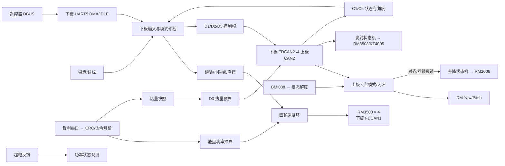

# RoboMaster 双板控制固件

面向 RoboMaster 机器人控制的 STM32 双板固件：上板运行云台、IMU、升降和发射闭环，下板运行遥控输入、四轮底盘及板间调度。

## 文档导航

| 文档 | 覆盖内容 |
| --- | --- |
| [上板工程](task_up/Readme.md) | F407 启动、任务、云台/升降/发射控制及模块索引 |
| [下板工程](task_down/Readme.md) | H723 启动、遥控/底盘/裁判系统/功率限制及模块索引 |
| [上板模块文档](task_up/docs/README.md) | 云台、升降、发射、电机、IMU、板间通信 |
| [下板模块文档](task_down/docs/README.md) | 遥控、底盘、裁判、电机、超电、板间通信 |
| [独立 LED 参考工程](01_LED/Readme.md) | 独立 Keil 工程与 RGB LED 示例，不属于双板固件 |

本页给出共用架构、构建入口和上下板接口；模块参数、状态机与调试入口见板级文档。

### 按任务阅读

| 你要做什么 | 建议阅读顺序 |
| --- | --- |
| 第一次了解工程 | 本页架构 → [上板工程](task_up/Readme.md) / [下板工程](task_down/Readme.md) → 对应模块文档索引 |
| 追遥控到电机 | [下板遥控](task_down/docs/remote.md) → [底盘控制](task_down/docs/chassis.md) → [下板电机](task_down/docs/motors.md) |
| 追云台到反馈 | [上板通信](task_up/docs/board-link.md) → [云台](task_up/docs/gimbal.md) → [IMU](task_up/docs/imu.md) → [上板电机](task_up/docs/motors.md) |
| 追发射热量许可 | [下板裁判系统](task_down/docs/referee.md) → [板间通信](task_down/docs/board-link.md) → [上板发射](task_up/docs/launcher.md) |
| 查升降互锁 | [上板升降](task_up/docs/lift.md) → [云台](task_up/docs/gimbal.md) → [板间通信](task_up/docs/board-link.md) |
| 查功率降额 | [下板裁判系统](task_down/docs/referee.md) → [底盘](task_down/docs/chassis.md) → [超电状态](task_down/docs/supercap.md) |

模块页不是源文件清单，而是按“输入条件 → 状态/算法 → 输出 → 保护/观察量”整理。每页顶部可回到本板模块索引，再由板级 README 返回本页。

## Architecture



当前下板 `BOARD_COMM_DEBUG=1`、`CHASSIS_BRINGUP_ENABLE=1`：运行调试底盘链路；`UpdataTask`（IMU 更新）和 UI 任务不创建。裁判 UART 解析、裁判对象初始化及 D3 发送路径仍在工程内。宏 `BOARD_JUDGE_ENABLE` 当前定义为 `0`，但源码未以该宏屏蔽 UART1 裁判接收路径。运行状态请以各板 README 中的宏和调用路径为准。

## Prerequisites

| 项目 | 工程中的实际配置 |
| --- | --- |
| 上板 MCU / Keil Target | STM32F407IGHx / `My_C` |
| 下板 MCU / Keil Target | STM32H723VGTx / `DM-MC02` |
| 独立示例 MCU / Target | STM32F407IGHx / `My_C` |
| 编译器 | ARM Compiler 5.06 update 7（build 960，工程定义 `__CC_ARM`） |
| F4 Device Pack | `Keil.STM32F4xx_DFP.2.17.1` |
| H7 Device Pack | `Keil.STM32H7xx_DFP.4.1.3` |
| HAL | 仓库内 STM32F4 HAL v1.8.3、STM32H7 HAL v1.11.5 |
| RTOS | 仓库内 FreeRTOS V10.3.1；CMSIS-RTOS v1/v2 适配层随工程提供 |
| 构建环境 | Windows + Keil MDK/µVision；需安装对应 Device Pack 和 ARM Compiler 5 |
| GCC / Clang | 当前 `.uvprojx` 未配置 GCC、Clang、CMake 或 Make 工具链 |
| 外部依赖 | `.gitmodules` 不存在；HAL、CMSIS、FreeRTOS 和驱动源码已随仓库提供 |

### 核心硬件与接口

| 板卡 | 源码配置的器件/接口 | MCU 引脚 |
| --- | --- | --- |
| 上板 | BMI088（SPI1）；DM Yaw/Pitch；RM2006 升降、RM3508 摩擦轮、KT4005 拨盘；CAN1/CAN2 | CAN1 PD0/PD1；CAN2 PB5/PB6 |
| 下板 | RM3508 四轮；UART5 DBUS；USART1 裁判 UART；FDCAN1/2/3 外设已初始化 | FDCAN1 PD0/PD1；FDCAN2 PB5/PB6；FDCAN3 PD12/PD13；UART5 RX PD2；USART1 RX PA10 |
| 独立 LED 工程 | GPIOH RGB LED；BMI088 相关 SPI/GPIO 驱动也在工程中 | LED：PH10 蓝、PH11 绿、PH12 红 |

表内为 MCU 管脚映射，不是板端连接器编号；总线电平、收发器、端接、电源和线序需按实物原理图确认。下板 H723 工程初始化了三路 FDCAN，但当前调试配置下板间链路走 FDCAN2、四轮/超电驱动路径使用 FDCAN1；外设已初始化不代表每路业务都启用。

## Getting Started

### 构建

在 Windows PowerShell 中进入仓库根目录；先安装 Keil MDK、ARM Compiler 5 和上表所列 Device Pack，并确认 `UV4.exe` 在 `PATH` 中。仓库没有子模块，不需要执行 `git submodule update`。

```powershell
UV4 -b task_up\MDK-ARM\My_C.uvprojx -t My_C -o "$env:TEMP\Train_code_plus_up.log"
UV4 -b task_down\MDK-ARM\DM-MC02.uvprojx -t DM-MC02 -o "$env:TEMP\Train_code_plus_down.log"
```

独立 LED 示例：

```powershell
UV4 -b 01_LED\MDK-ARM\My_C.uvprojx -t My_C -o "$env:TEMP\Train_code_plus_led.log"
```

产物目录按工程设置分别为 `task_up/MDK-ARM/My_C/`、`task_down/MDK-ARM/DM-MC02/`、`01_LED/MDK-ARM/My_C/`。构建只生成固件，不会下载到设备。工程 XML 未提供可复用的命令行 Flash Driver/FlashUtil 配置，因此本仓库不列未经核实的命令行烧录参数；下载前在 µVision 中为对应芯片配置实际调试器和 Flash Algorithm，再由人工通过 Download 操作烧录。

### 上电观察

| 工程 | 源码可确认的表现 | 不代表什么 |
| --- | --- | --- |
| 上板 | `LedTask` 启动后绿灯常亮 500 ms，再按配置闪烁；观察 `imu_dev.work_state`、DM/RM/KT 电机状态、`Board_HeartBeat.status` | 绿灯闪烁只表明 LED 任务运行，不代表 IMU、电机、通信或机构自检通过 |
| 下板调试配置 | `BOARD_COMM_DEBUG=1` 时创建 Command/Ctrl/Monitor/Connect 任务；无等价的故障码启动灯/串口启动日志 | FDCAN 外设已初始化不代表收到电机/超电反馈；裁判模块在线还需看数据新鲜度 |
| 独立 LED | `LedTask` 绿灯常亮 500 ms 后闪烁；LED 接口为 GPIOH10/11/12 | 示例灯态不是整车自检流程 |

下板建议在 Keil Watch 观察 `rc_dev.work_state`、`chassis_ctrl.state.all_online`、`board.status->status`、`judge.status->status`、`supercap.state` 和 `power_limit_state`。源码未发现统一的上电自检通过标志或常驻串口启动日志，不能用一个灯色推断整车安全状态。

## Control Pipeline

两板 FreeRTOS tick 配置为 1 kHz，HAL 时间基准也由 TIM2 产生 1 ms tick。任务中的 `osDelay(1)` 是至少让出 1 tick，实际循环周期还包含本轮执行时间；只有上板 ControlTask 使用 `osDelayUntil(...,1)` 对齐 1 ms 节拍。

| 板卡/任务 | 优先级 | 周期/职责 |
| --- | --- | --- |
| 上板 ControlTask | `osPriorityRealtime` | 1 ms 对齐；IMU 更新 → `Module_Work()` → 电机命令 → `Launcher_Work()` → C1/C2 尝试发送 |
| 上板 MonitorTask | `osPriorityRealtime` | `osDelay(1)`；IMU、DM/RM/KT、遥控和板间心跳 |
| 上板 LedTask | `osPriorityAboveNormal` | LED 任务；`CommunityTask` 仅在 `#if 0` 下，不创建 |
| 下板 CommandTask | `osPriorityHigh` | `osDelay(1)`；DBUS 解析及键鼠状态 |
| 下板 CtrlTask / MonitorTask | `osPriorityAboveNormal` | `osDelay(1)`；底盘闭环/发射及设备心跳 |
| 下板 ConnectTask | `osPriorityHigh` | `osDelay(BOARD_COMM_D1D2_PERIOD_MS)`，当前 1 ms 控制帧发送；D3 单独 10 ms 调度 |
| 下板 UpdataTask / UITask | below-normal / above-normal | 当前调试宏下 UpdataTask 不创建；UI 宏为 0，不创建 |

### 关键控制闭环

- **上板云台**：BMI088 原始采样 → BMI088 中间层/EKF → `imu_dev` 姿态和角速度 → Yaw/Pitch 模式控制 → DM 电机 CAN 力矩。`G_MEC` 使用机械 Yaw 定位控制；`G_RATE` 使用角速度目标和内环；Pitch 叠加余弦重力补偿。最终力矩限幅为 6 N·m（具体状态/配置见[上板云台文档](task_up/docs/gimbal.md)）。
- **下板底盘**：UART5 DBUS + 键鼠 → `Chassis_Input_Update()` → 跟随/小陀螺 → 四轮速度 PI/P 控制 → 公共功率比例缩放 → RM 电机 0x200 组帧。四轮任一离线或指令异常时停输出。
- **裁判与发射**：USART1 DMA/IDLE 收帧 → SOF/CRC8/CRC16 校验 → 裁判命令更新热量/功率快照 → D3；上板校验 D3 flags/时间新鲜度 → 本地热量估计/限频 → 摩擦轮和拨盘输出。
- **板间反馈**：下板 FDCAN2 发 D1/D2/D3/D5；上板 CAN2 回 C1/C2。心跳/有效位与帧接收分开判断。

云台、升降、发射状态机和底盘输入/掉头状态机详见对应模块文档；仅在 C 代码实际选择的路径描述为运行功能。

### 板间闭环边界

| 数据方向 | 生产端 | 消费端 | 关键限制 |
| --- | --- | --- | --- |
| DBUS/键鼠 → D1/D2/D5 | 下板 `CommandTask`、`ConnectTask` | 上板 `communicate.c` 与 `gimbal.c`/`launcher.c` | 遥控在线状态、D1 车辆状态、D5 valid/source/type 各自独立；单帧到达不等于整组状态有效 |
| 裁判 → D3 | 下板 USART1 裁判解析与 `Board_Pack_D3()` | 上板 `launcher.c` 热量状态 | `flags` 与接收年龄同时决定有效性；D3 调度周期不是热量数据保证周期 |
| 上板电机/机构 → C1/C2 | 上板 `Send_To_Down_Board()` | 下板板间协议、跟随/掉头逻辑 | CAN 邮箱接受与对端收到是不同阶段；跟随还校验时间戳、角度范围和跳变 |
| 裁判功率/缓冲 → 四轮限幅 | 下板 `Judge_GetPowerSnapshot()` | 下板 `Power_Limit_GetTarget()`/`Power_Limit_Apply()` | 快照无效时进入配置回退；超电反馈当前不闭合功率环 |

遇到跨板症状时按“发送字段 → 总线发送结果 → 对端接收心跳 → 解码值/有效位 → 使用模块状态”逐段定位。不要因本地 `HAL_OK` 或对端总体在线就跳过字段级检查。

## Protocol & Tuning

板间链路使用 11 位标准 ID、8 字节经典 CAN 帧；下板 FDCAN 配置为经典帧，不是 CAN-FD。16 位字段均高字节在前。角度使用线性定点映射到 `uint16_t`，不传 IEEE 754 浮点数。

| ID | 方向 | Byte 定义（下标从 0 开始） | 说明 |
| --- | --- | --- | --- |
| `0xD1` | 下→上 | b0：car_state[1:0]、gimbal_mode[2]、vision_mode[5:3]、game_start[6]、my_color[7]；b1–2 `v_x`；b3–4 `v_y`；b5 bit0 摩擦轮使能、bit1 模式、bit2 触发、bit3 过洞、bit4 R掉头进行中、bit5 供弹许可 | 速度字段线性映射 [-8000,8000]；转轮与供弹许可分离，需同步更新上下板 |
| `0xD2` | 下→上 | b0–1 Pitch IMU；b2–3 Yaw IMU；b4–5 Pitch 机械角；b6–7 Yaw 机械角 | IMU 映射 [-360,360] deg；机械映射 [-4,4] rad |
| `0xD3` | 下→上 | b0–1 热量上限；b2–3 枪管热量；b4–5 冷却率；b6 源序号；b7 bit0 参数有效、bit1 热量有效 | 热量单位按裁判系统；当前周期 10 ms；无效位不会因收到 CAN 帧而自动变有效 |
| `0xD4` | 下→上 | b0–7 血量字节 | 默认 `BOARD_COMM_D4_ENABLE=0`；上板目前仅更新该 ID 心跳 |
| `0xD5` | 下→上 | b0 bit0 有效、bit1 来源、bit2 控制类型；b1 鼠标键；b2–3 有符号 Yaw；b4–5 有符号 Pitch；b6–7 保留 | 当前角速度量化为 0.1 deg/s/LSB；键鼠运行路径发角速度格式 |
| `0xC1` | 上→下 | b0 bit0–6：Yaw/Pitch/升降/右左摩擦轮/拨盘/视觉在线；b1 升降状态；b2–5 当前为 0 deg 的映射值；b6–7 为 0 | 每类反馈最短发送间隔 5 ms，C1/C2 交替争用邮箱 |
| `0xC2` | 上→下 | b0–1 Yaw 机械；b2–3 Pitch 机械；b4–5 Yaw IMU；b6–7 Pitch IMU | 机械映射 [-4,4] rad；IMU 映射 [-360,360] deg |

`0xD1/0xD2/0xD5` 控制组在 FIFO 空间足够时成组入队；`0xD3` 失败后保留到下一调度周期重试。入队成功只说明 MCU 的 CAN/FDCAN 驱动接受发送请求，不证明对端收到。完整字段和转发路径见[上板通信](task_up/docs/board-link.md)与[下板通信](task_down/docs/board-link.md)。

| 调参领域 | 配置入口 | 当前关键量 |
| --- | --- | --- |
| 云台归中/输出 | `task_up/Application/ConfigLayer/gimbal_init_config.h`、`task_up/Application/ModuleLayer/gimbal.h` | 归中目标 0 deg；超时 6000 ms；稳定 30 ms；Yaw/Pitch 力矩上限 6 N·m；Pitch 重力补偿开关 |
| 升降 | `task_up/Application/ConfigLayer/lift_config.h` | 行程 280 电机圈；找顶速度 2865 rpm；找顶/运动超时 90000 ms；位置量以 count 计，不等于机械 mm |
| 发射/热量 | `task_up/Application/ConfigLayer/launcher_config.h` | 摩擦轮目标 1500 rpm；热量余量 20；恢复余量 30；最大 15 发/s；D3 超时 100 ms |
| 底盘 | `task_down/Application/ConfigLayer/chassis_config.h` | `CHASSIS_MAX_VX/VY/WZ=25/25/20`（工程控制域，不直接等同 SI 单位）；跟随停止5°/恢复6°；停稳受扰和小陀螺退出可叠加辅助回正前馈，见[控制说明](task_down/docs/chassis.md#跟随闭环与故障锁存)；反馈超时50 ms；轮力矩受模式限幅 |
| 底盘功率 | `task_down/Application/ConfigLayer/power_limit_config.h` | 开关 1；裁判快照无效时回退预算 45 W；在线余量 5 W；超电反馈当前只记录，不参与该闭环 |
| 板间帧 | `task_down/Application/ConfigLayer/board_comm_config.h`、`task_up/Application/ConfigLayer/board_remote_config.h` | D1/D2 1 ms、D3 10 ms、D4 关闭、D5 开启；上板每类反馈最短 5 ms |

## Troubleshooting & Safety

### 常见症状的定位入口

| 症状 | 先看哪一层 | 再进入 |
| --- | --- | --- |
| 遥控在线但底盘不动 | `rc_dev.work_state`、`chassis_input_cmd.valid/source` | [遥控](task_down/docs/remote.md) → [底盘](task_down/docs/chassis.md) → [电机](task_down/docs/motors.md) |
| 底盘能转但跟随不稳定 | `board.rx_meg` 的 C2 Yaw 与接收时间 | [下板通信](task_down/docs/board-link.md) → [底盘跟随](task_down/docs/chassis.md) |
| 云台无力/目标不跟手 | D1 在线/使能、IMU 状态、DM 反馈、当前模式 | [上板通信](task_up/docs/board-link.md) → [云台](task_up/docs/gimbal.md) → [IMU](task_up/docs/imu.md) |
| 发射请求有效但不拨盘 | `launcher.enabled/state`、D3 flags/age、拨盘在线和热量源 | [裁判](task_down/docs/referee.md) → [通信](task_up/docs/board-link.md) → [发射](task_up/docs/launcher.md) |
| 升降一直等待或报故障 | `lift.state/home_valid/fault_code`、Pitch 对齐量 | [升降](task_up/docs/lift.md) → [云台](task_up/docs/gimbal.md) |
| 四轮输出明显低于 PID 输出 | `power_limit_state.scale/fallback_used/target_unreachable` | [裁判](task_down/docs/referee.md) → [底盘功率限制](task_down/docs/chassis.md) |

这些变量用于区分软件阶段，不替代示波器、总线分析仪或机械检查；涉及电机方向、机构端点和功率实测的结论须由台架/实机验证。

| 现象/条件 | 源码保护或观察点 |
| --- | --- |
| 上下板心跳丢失/车辆失能 | 上板云台选择 `G_SLEEP` 并将力矩清零；MonitorTask 更新设备离线状态 |
| 任一底盘轮离线或控制量非法 | 四轮在线门槛失败后调用 `Chassis_Control_Stop()`，写零力矩并发送组帧 |
| 裁判数据缺失/过期 | D3 的有效位分开表示参数/热量有效；上板热量来源状态未就绪时禁止供弹；功率预算改用 45 W 回退值 |
| 升降行程/超时/堵转异常 | 升降状态机进入 `LIFT_FAULT` 或 `LIFT_STALL_STOP`，力矩清零；C1 b1 回报状态 |
| 电机力矩/输出超限 | 云台、底盘、拨盘路径分别有力矩/原始输出限幅；电机温度反馈可读，但本仓库不能据此推断所有电机都有统一软件超温切断 |
| HAL 初始化失败 | `Error_Handler()` 关闭中断并停在死循环；源码没有统一错误灯码 |

首次上电前卸除弹丸、架空底盘并确保升降/云台行程无障碍；限制电源和机构运动范围，先逐个验证方向、编码器、离线保护及 CAN 心跳，再验证闭环。任何 PID、角度符号、机械行程或限矩变更都要按板级模块说明人工台架确认。编译通过不等于实机验收。
