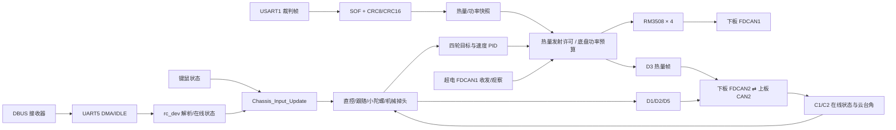

# 下板固件（STM32H723VGTx）

[返回项目总览](../README.md) · [上板工程](../task_up/Readme.md) · [下板模块目录](docs/README.md)

下板处理遥控器/键鼠输入、四轮底盘、裁判系统数据、底盘功率预算及板间 CAN 调度。Keil Target 为 `DM-MC02`。

## Architecture 与启动



`main()` 初始化时钟、GPIO、DMA、SPI、FDCAN1/2/3、串口和定时器，再调用 `DEVICE_Init()`、`DRIVER_Init()` 并启动 FreeRTOS。当前 `BOARD_COMM_DEBUG=1` 且 `CHASSIS_BRINGUP_ENABLE=1`，选择调试底盘控制路径；该路径跳过常规 IMU/infantry/UI 初始化，但仍初始化裁判对象、遥控、板间协议、底盘和超电通信。

## 工程结构与源码入口

```text
task_down/Application/
├─ ConfigLayer/      板间、底盘、功率限制、超电与设备配置
├─ DeviceLayer/      遥控、裁判、超电、电机和设备对象
├─ DriverLayer/      UART、FDCAN、DMA/IDLE 接口
├─ HardwareLayer/    RM 电机与通用硬件定义
├─ ModuleLayer/      底盘输入/跟随/自旋/四轮控制、发射请求
├─ ProtocolLayer/    DBUS、裁判帧、D/C 板间、超电协议
├─ AlgorithmLayer/   功率估算与限幅、CRC 等算法
└─ TaskLayer/        Command、Ctrl、Monitor、Connect 任务
```

| 源码入口 | 主要职责 | 当前调试分支行为 |
| --- | --- | --- |
| `Core/Src/main.c` | 外设初始化、设备/驱动初始化、启动 RTOS | 初始化 FDCAN、UART、DMA 等底层外设 |
| `Application/DeviceLayer/device.c` | 设备对象初始化分支 | 初始化裁判、RC、底盘、发射与超电对象 |
| `Application/TaskLayer/Command_Task.c` | DBUS 解析及键鼠状态 | 解析后延时 1 tick |
| `Application/TaskLayer/Ctrl_Task.c` | 输入、跟随/自旋、底盘、发射、超电发送 | 1 tick 控制循环 |
| `Application/TaskLayer/connect_task.c` | D1/D2/D3/D5 调度、D4条件发送 | 控制帧检查 FIFO，D3 单独调度 |
| `Application/ProtocolLayer/judge_protocol.c` | 裁判同步、CRC、命令分发 | USART1 IDLE 后处理 DMA 缓冲 |

### 数据对象与板间接口

| 数据对象 | 更新方 → 使用方 | 重点字段/风险 |
| --- | --- | --- |
| `rc_dev` | UART5/DBUS → CommandTask 与 chassis input | 在线状态、通道、S1/S2、键鼠位图；遥控失联时键鼠源不能独立保留运动命令 |
| `chassis_input_cmd` | 遥控/键鼠输入仲裁 → 跟随/小陀螺/底盘 | 当前控制源、valid 和 `(vx,vy,wz)`；请求源与最终选中的模式可能不同 |
| `board.rx_meg` | C1/C2 解码 → 跟随/掉头/状态显示 | 角度与 `rx_tick` 要同时新鲜；心跳不等于角度字段有效 |
| `judge_heat_data` | 裁判 parser → D3 打包 | 参数和热量各有 `seen/tick` 与有效期 |
| `judge_power_data` | 裁判 parser → 功率预算 | 上限与 buffer 两帧分别校验时间戳；任一无效会进入回退预算 |
| `power_limit_state` | 裁判快照/电机模型 → 四轮输出缩放 | 查看 target、scale、fallback、buffer guard 和 target unreachable |
| `supercap.state/feedback` | FDCAN1 → Watch 观察 | ONLINE 只说明有近期反馈，不代表已启用超电功率输出 |

建议先从“输入来源和 valid”向下追到“模式状态、目标轮速、PID 力矩、功率比例、CAN 发送”，避免只盯电机命令末端。

模块索引：[遥控](docs/remote.md) · [底盘](docs/chassis.md) · [裁判](docs/referee.md) · [电机](docs/motors.md) · [超电](docs/supercap.md) · [通信](docs/board-link.md)。

### 任务和节拍

FreeRTOS tick 为 1 kHz；当前任务使用 `osDelay(1)`，周期包含代码执行时间，不等于严格对齐的 1.000 ms。TIM2 仅提供 HAL 1 ms tick。

| 任务 | 优先级 / 栈 | 当前执行内容 |
| --- | --- | --- |
| CommandTask | High / 1024 B | 每轮解析遥控数据、更新键鼠状态，再 `osDelay(1)` |
| CtrlTask | AboveNormal / 2048 B | 输入仲裁 → 跟随/小陀螺 → 四轮控制 → 发射状态机 → 超电控制帧，再延时 1 tick |
| MonitorTask | AboveNormal / 2048 B | 1 tick 循环；遥控、底盘电机、发射、板间、裁判和超电心跳 |
| ConnectTask | High / 2048 B | 当前每 1 tick 尝试 D1/D2/D5；D3 每 10 ms 独立排期；D4 默认关闭 |
| UpdataTask | BelowNormal / 1024 B | `BOARD_COMM_DEBUG=1` 时不创建；非调试分支才更新 IMU |
| UITask | AboveNormal / 2048 B | `BOARD_UI_ENABLE=0` 时不创建 |

任务栈值来自 `osThreadAttr_t.stack_size` 字节配置。ConnectTask 发送控制组前检查 FIFO 空位；空间不足时本轮延后，不拆开发送 D1/D2/D5。

## 硬件与构建

| 项目 | 实际配置 |
| --- | --- |
| MCU / Keil Target | STM32H723VGTx / `DM-MC02` |
| 编译器 | ARM Compiler 5.06 update 7（build 960，ARM-ADS 工具集） |
| Device Pack | `Keil.STM32H7xx_DFP.4.1.3` |
| HAL / RTOS | 仓库内 STM32H7 HAL v1.11.5、FreeRTOS V10.3.1 |
| 主控电机 | RM3508 四轮，RM 驱动器和 FDCAN1 |
| 遥控器 | UART5 RX PD2；100000 baud、8 data bits、even parity、2 stop bits（8E2） |
| 裁判系统 | USART1 RX PA10 / TX PA9；115200、8N1；DMA + 空闲线回调 |
| 板间 CAN | FDCAN2 RX/TX PB5/PB6；标准 11 位、经典 8-byte 帧 |
| FDCAN 其他映射 | FDCAN1 PD0/PD1；FDCAN3 PD12/PD13；当前业务不因此自动启用 |
| GCC/Clang / 子模块 | 工程未配置 GCC/Clang；根目录无 `.gitmodules` |

构建命令（仓库根目录 PowerShell）：

```powershell
UV4 -b task_down\MDK-ARM\DM-MC02.uvprojx -t DM-MC02 -o "$env:TEMP\Train_code_plus_down.log"
Get-Content "$env:TEMP\Train_code_plus_down.log"
```

产物目录为 `task_down/MDK-ARM/DM-MC02/`。工程没有已核实的命令行 Flash Driver 设置；烧录前通过 µVision 为实物板配置调试器、供电和 Flash Algorithm，再由人工执行下载。

## Core Control Pipeline

### 输入、模式和轮速闭环

UART5 DMA/IDLE 数据由 `rc_protocol`/`rc_sensor` 转成 `rc_dev.info`；CommandTask 同步键鼠状态；`chassis_input.c` 决定输入源并生成 `(vx, vy, wz)`。控制路径依次运行云台跟随或小陀螺、四轮逆解、轮速 PID、输出限幅和功率比例限制，再通过 FDCAN1 发送四轮 RM 电机组帧。

| 控制源 | 触发入口 | 旋转行为 |
| --- | --- | --- |
| 遥控直控 | S1 下位路径 | 摇杆生成平移/转向指令 |
| 遥控跟随 | S2 选择跟随 | 使用 C2 机械 Yaw 反馈驱动底盘对正 |
| 小陀螺 | S2 下拨或键鼠 C | 基础旋转目标 25（控制域单位），配置斜坡步进 0.1 |
| 键鼠 | 遥控在线且 S1 上位，F 选择键鼠 | W/S、A/D 平移；Z 跟随、X 机械、C 小陀螺；R 按模式运行掉头/基准切换 |

输入映射、快捷键生效档位、掉头状态阶段和反馈等待条件见[遥控与键鼠模块](docs/remote.md)。各模式先合成为 `chassis_cmd_t`；模式模块可能修改速度、有效位和 `source`，最终控制以 CtrlTask 本拍指令为准。

`CHASSIS_MAX_VX/VY/WZ` 当前是 25/25/20 的控制域限幅值，并非文档定义的 m/s 或 rad/s。轮速反馈转换到 rad/s；通用 RM 电机协议含原始 rpm/count 数据。跟随依赖 C2 新鲜度，50 ms 超时或单次跳变超过 30 deg 会进入异常处理。

### 有效功率限制

当前 `CHASSIS_POWER_LIMIT_ENABLE=1`，CtrlTask 每轮底盘控制调用 `Power_Limit_GetTarget()` 并对四轮输出应用共同缩放。目标预算使用有效裁判功率上限与缓冲能量；快照无效/过期/范围非法时使用固定 45 W 回退预算。缓冲能量低于 45 J 时触发强降额。模型/系数限幅只约束代码输出估算值，不能替代电气实测，也不证明实车一定满足裁判功率上限。

超电反馈 `chassis_power/cap_voltage/cap_current/ability` 当前传入功率限制状态用于观察；`SUPERCAP_CAP_SWITCH=0`、`SUPERCAP_POWER_LIMIT=0`、预充/功率缓冲关闭，超电未作为功率闭环执行器。

### 裁判系统数据路径

USART1 使用 DMA 接收后由空闲线处理函数调用 `judge_receive()`；解析帧头 `0xA5`、CRC8、命令 ID 和 CRC16，通过后更新裁判结构与时间戳。`0x0201` robot status 提供枪管热量上限/冷却率和底盘功率限制；`0x0202` power/heat 提供 17 mm 1 号枪管热量与 buffer energy。ConnectTask 将热量快照打包到 D3，功率限制独立读取 power snapshot。

`BOARD_JUDGE_ENABLE` 当前定义为 0，但仓库未用它守护 USART1 初始化/裁判回调；裁判接收实际取决于 USART1 DMA/IDLE 驱动和有效帧。`judge.status` 在线标志也不能替代 `limit_seen/buffer_seen` 与时间戳新鲜度。

## FSM、协议与参数

底盘输入状态含跟随/机械/小陀螺以及键鼠掉头 `IDLE → PREPARE → POSITION → RESTORE`；掉头需要有效 C2 反馈与成功控制帧交接，超时 2500 ms 后取消。轮控要求四轮均在线；任意电机离线或数据无效会清零并停止四轮。

发射控制在下板只负责把许可、模式和触发写入 D1；热量预算、摩擦轮/拨盘输出状态机在上板执行。详细状态见[上板发射文档](../task_up/docs/launcher.md)。板间完整字节表以[根 README](../README.md#protocol--tuning)为准。

| 本板帧 | Byte 字段概要 |
| --- | --- |
| D1 `0xD1` | b0 状态位域；b1–4 速度映射；b5 bit0–3 发射许可/模式/触发/过洞 |
| D2 `0xD2` | b0–7 Pitch/Yaw IMU 角和 Pitch/Yaw 机械角，均为高字节在前的线性定点 |
| D3 `0xD3` | b0–5 裁判热量/冷却；b6 源序号；b7 有效 flags |
| D4 `0xD4` | 8 字节血量转发，默认 `BOARD_COMM_D4_ENABLE=0` |
| D5 `0xD5` | b0 输入标志；b1 鼠标键；b2–5 有符号 Yaw/Pitch 角速度，量化 0.1 deg/s/LSB |
| C1/C2 | 下板接收上板电机/升降状态及机械 rad、IMU deg 角度 |

| 配置文件 | 关键当前值/用途 |
| --- | --- |
| `Application/ConfigLayer/board_comm_config.h` | Debug=1；D1/D2=1 ms；D3=10 ms 开；D4=10 ms 但关闭；D5 开；热量有效超时 300 ms、参数上限超时 1500 ms |
| `Application/ConfigLayer/chassis_config.h` | 底盘 bring-up/遥控/键鼠/跟随/小陀螺开关；速度环 kp=0.8；测试力矩 2 N·m；跟随/小陀螺力矩 4 N·m |
| `Application/ConfigLayer/power_limit_config.h` | 开关 1；回退 45 W；裁判上限 margin 5 W；buffer 目标 59 J、guard 45 J；时间步长上限 200 ms |
| `Application/ConfigLayer/supercap_config.h` | bring-up 通信开、离线超时 100 ms；功率输出/预充/Turbo/缓冲开关均为 0 |
| `Application/ConfigLayer/board_comm_config.h` | `BOARD_UI_ENABLE=0`、`BOARD_CAP_ENABLE=0`；旧 judge enable 宏为 0 但未守护 UART1 接收实现 |

### 功率目标与实际输出的关系

```text
裁判 0x0201/0x0202 快照
  → 校验 limit_seen、buffer_seen 与各自年龄
  → 选择在线预算或 45 W fallback
  → 速度环计算四轮候选力矩
  → 公共比例 scale 缩放四轮力矩
  → RM 0x200 组帧
```

`power_limit_state` 中的预测功率用于固件内部估算；它不是裁判系统的实测功率回读。超电 0x211 字段目前只进入观察结构，不能把超电在线状态解释为功率限制闭环已从超电获得反馈。参数的准确范围和边界见[底盘控制页](docs/chassis.md)与[超电页](docs/supercap.md)。

模块索引：[遥控与键鼠](docs/remote.md) · [底盘](docs/chassis.md) · [裁判系统](docs/referee.md) · [电机](docs/motors.md) · [超电](docs/supercap.md) · [板间通信](docs/board-link.md)

## Troubleshooting & Safety

### 调试变量路径

| 变量 | 用途 |
| --- | --- |
| `rc_dev.work_state` / `rc_dev.info` | DBUS 在线、通道、拨杆和键鼠位图 |
| `chassis_input_cmd` | 当前统一底盘指令、来源和 valid 位 |
| `chassis_follow` / `chassis_spin` | 模式选择、生效、故障锁存、目标与输出旋转速度 |
| `chassis_ctrl.state.wheel_target[]` / `wheel_speed[]` | 运动学分配后的轮速目标和反馈 |
| `chassis_ctrl.state.wheel_torque_out[]` | PID、源限矩和功率限制后的力矩 |
| `power_limit_state` | target、fallback、buffer guard、公共比例 scale 与预测输出 |
| `judge_power_data` / `judge_heat_data` | 裁判功率/热量有效位和时间戳 |
| `board.status` / `board.rx_meg` | 板间发送结果、上板反馈角和状态 |
| `supercap.state/feedback` | 超电在线与反馈观测；不代表已参与功率控制 |

建议沿 `输入 → 模式/valid → C2新鲜度 → wheel_target → 速度环 → power scale → CAN输出` 逐层检查，不要只观察最终电机力矩。

| 故障线索 | 代码保护/观察量 |
| --- | --- |
| DBUS 失联 | `rc_dev.work_state`、通道和拨杆；确认失联时目标不会残留。遥控掉线后键鼠源也不能假定仍有效 |
| 任一轮离线 | `wheel_online[]`、对应 RM 反馈 ID 和 `offline_cnt`；在线门槛要求四轮全在线，失败则四轮零力矩 |
| 跟随跳变/过期 | 检查 C2 反馈时间戳、角度符号、30 deg 跳变门限和 50 ms 超时 |
| 裁判数据无效 | 检查 USART1 DMA/IDLE、CRC、命令帧时间戳、`judge_power_data`；功率预算会切换至 45 W 回退 |
| 超电离线 | 100 ms 无反馈后 `supercap.state=OFFLINE`；当前功率控制不依赖超电输出 |
| CAN 发送拥堵 | `control_tx_defer_count`、D3 成功/失败/间隔计数；D1/D2/D5 组包不足则延后，D3 失败重试 |

源码没有统一电机温度硬切断策略的证据；温度/电调错误字段能否触发硬件保护需核对各驱动器。初次上电须架空底盘并限速，逐轮检查方向/反馈和离线停机；再测模式切换、C2 超时、D3 新鲜度和功率预算。不要用改低在线判据或旁路保护的方式掩盖故障。
