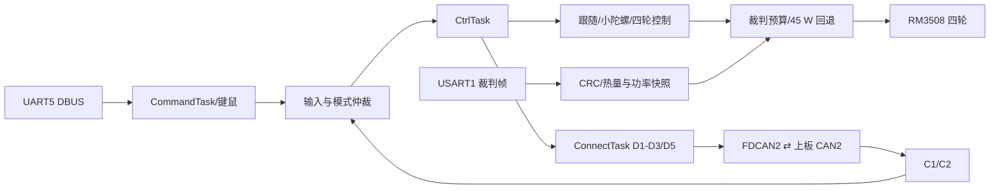

# 下板模块文档

[返回下板工程说明](../Readme.md) · [返回项目总览](../../README.md)

本目录对应 STM32H723 下板调试控制链路。输入经 CommandTask 更新，CtrlTask 在 1 tick 循环中形成底盘命令和输出，ConnectTask 负责上下板帧调度；裁判功率数据供热量预算和底盘功率限制使用。

| 模块 README | 重点 |
| --- | --- |
| [遥控与键鼠](remote.md) | UART5 DBUS、来源切换和模式入口 |
| [底盘](chassis.md) | 跟随/小陀螺、速度控制、功率限制和轮离线保护 |
| [裁判系统](referee.md) | USART1 CRC、热量/功率快照及 D3/D4 |
| [电机](motors.md) | 四轮 RM3508、反馈 ID、rpm/rad/s 和力矩输出 |
| [超电](supercap.md) | FDCAN1 通信、当前 bring-up 开关和观测字段 |
| [板间通信](board-link.md) | D1–D5 调度、FIFO 延后/重试和 C1/C2 接收 |

## 推荐阅读路线

| 调试目的 | 阅读路线 | 关键状态/变量 |
| --- | --- | --- |
| 遥控输入异常 | [遥控](remote.md) → [板间通信](board-link.md) | `rc_dev.work_state`、摇杆/拨杆、`chassis_input_cmd.valid/source` |
| 跟随模式停车 | [板间通信](board-link.md) → [底盘](chassis.md) → [电机](motors.md) | C2 age/jump、follow fault latch、四轮 online |
| 四轮输出过小 | [电机](motors.md) → [底盘](chassis.md) → [裁判](referee.md) | 速度误差、source torque limit、功率 `scale/fallback` |
| 发射热量/功率不更新 | [裁判](referee.md) → [板间通信](board-link.md) → 上板[发射](../../task_up/docs/launcher.md) | CRC、`seen/tick`、D3 flags、接收年龄 |
| 超电状态不符合预期 | [超电](supercap.md) → [底盘功率限制](chassis.md) | `0x211` 更新、offline 计时、开关宏及功率状态 |

## 控制域与物理量边界

- `CHASSIS_MAX_VX/VY/WZ` 与 follow/spin 输出使用工程控制域数值，不应直接写成 m/s 或 rad/s；只有代码定义明确换算关系时才标物理单位。
- RM 电机反馈同时保留转子 rpm 和换算后的输出轴 rad/s；四轮 PID 力矩为 N·m 控制域，发送帧则编码为 RM 原始电流计数。
- 裁判热量与 buffer energy 使用裁判字段单位；超电 `chassis_power` 的软件字段量纲未确认，不可据字段名当作 W。
- FDCAN 本地入队成功、对端 CAN 心跳、协议字段有效是三种不同证据，应分开确认。

硬件方向、失联保护和首次上电步骤见[下板 README](../Readme.md#troubleshooting--safety)。功率模型输出不是实测功率证明，超电输出当前配置关闭。
