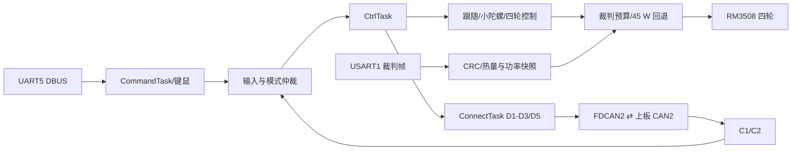

# 下板模块文档

[返回下板工程说明](../Readme.md) · [返回项目总览](../../README.md)

本目录对应 STM32H723 下板调试控制链路。输入经 CommandTask 更新，CtrlTask 在 1 tick 循环中形成底盘命令和输出，ConnectTask 负责上下板帧调度；裁判热量和功率数据分别供发射预算与底盘功率限制使用。

## 按模块讲解的顺序

| 模块 | 一句话说清职责 | 输入 → 处理 → 输出 | 优先打开的源码 |
| --- | --- | --- | --- |
| 遥控/键鼠 | 将 DBUS 字节变成在线输入和统一底盘指令 | UART5 → 解码、按键状态、来源仲裁 → `rc_dev` / `chassis_input_cmd` | [rc_protocol.c](../Application/ProtocolLayer/rc_protocol.c)、[chassis_input.c](../Application/ModuleLayer/chassis_input.c) |
| 底盘 | 将平移/转向请求闭环分配到四轮 | 输入、C2、轮速 → 跟随/自旋、轮速环、限功 → 四轮力矩 | [control_task.c](../Application/TaskLayer/control_task.c)、[chassis_control.c](../Application/ModuleLayer/chassis_control.c) |
| 功率限制 | 由裁判预算决定四轮输出比例 | 上限/缓冲、轮速/候选力矩 → 预算反馈、模型预测、比例搜索 → `scale` | [power_limit.c](../Application/AlgorithmLayer/power_limit.c)、[power_limit_config.h](../Application/ConfigLayer/power_limit_config.h) |
| 裁判 | 校验外部帧并给控制模块提供带时间戳的数据 | USART1 → 帧同步、CRC、命令更新 → 热量/功率快照 | [judge_protocol.c](../Application/ProtocolLayer/judge_protocol.c)、[judge.c](../Application/DeviceLayer/judge.c) |
| 四轮电机 | 维护各轮反馈并发送一组电流命令 | 0x201–0x204 → 反馈/在线；四轮力矩 → 0x200 | [motor.c](../Application/DeviceLayer/motor.c)、[RM_motor.c](../Application/HardwareLayer/RM_motor.c) |
| 超电 | 当前维护通信和反馈观测 | 0x211 → 解码与在线；配置 → 0x222 | [supercap.c](../Application/DeviceLayer/supercap.c)、[supercap_protocol.c](../Application/ProtocolLayer/supercap_protocol.c) |
| 板间通信 | 发送控制和热量，接收云台/机构反馈 | 本地请求/快照 → D1/D2/D3/D5；C1/C2 → 状态对象 | [connect_task.c](../Application/TaskLayer/connect_task.c)、[board_protocol.c](../Application/ProtocolLayer/board_protocol.c) |

功率限制的详细实现集中在[底盘页](chassis.md)，不用将它误当成上板同名算法文件。全项目讲解口径见[根 README](../../README.md#项目讲解与源码速查)。

### 一轮下板控制中的先后关系

`StartCtrlTask()` 的当前路径依次更新输入、调试云台/过洞命令、跟随/小陀螺模式、跟随/小陀螺输出、四轮闭环、发射请求和超电发送。ConnectTask 独立发送 D 帧，CommandTask 独立更新输入；任务周期目标为 1 tick，不保证输入、控制和发包在同一时刻完成。解释跨板动作时要把各段数据的更新时间分别说清。

| 模块 README | 重点 |
| --- | --- |
| [遥控与键鼠](remote.md) | UART5 DBUS、来源切换和模式入口 |
| [底盘](chassis.md) | 跟随/小陀螺、速度控制、功率限制和轮离线保护 |
| [裁判系统](referee.md) | USART1 CRC、热量/功率快照及 D3/D4 |
| [电机](motors.md) | 四轮 RM3508、反馈 ID、rpm/rad/s 和力矩输出 |
| [超电](supercap.md) | FDCAN1 通信、当前 bring-up 开关和观测字段 |
| [板间通信](board-link.md) | D1–D5 调度、FIFO 延后/重试和 C1/C2 接收 |

## 推荐阅读路线

| 调试目的 | 阅读路线 | 关键状态/变量 |
| --- | --- | --- |
| 遥控输入异常 | [遥控](remote.md) → [板间通信](board-link.md) | `rc_dev.work_state`、摇杆/拨杆、`chassis_input_cmd.valid/source` |
| 跟随模式停车 | [板间通信](board-link.md) → [底盘](chassis.md) → [电机](motors.md) | C2 age/jump、follow fault latch、四轮 online |
| 四轮输出过小 | [电机](motors.md) → [底盘](chassis.md) → [裁判](referee.md) | 速度误差、source torque limit、功率 `scale/fallback` |
| 发射热量/功率不更新 | [裁判](referee.md) → [板间通信](board-link.md) → 上板[发射](../../task_up/docs/launcher.md) | CRC、`seen/tick`、D3 flags、接收年龄 |
| 超电状态不符合预期 | [超电](supercap.md) → [底盘功率限制](chassis.md) | `0x211` 更新、offline 计时、开关宏及功率状态 |

## 控制域与物理量边界

- `CHASSIS_MAX_VX/VY/WZ` 与 follow/spin 输出使用工程控制域数值，不应直接写成 m/s 或 rad/s；只有代码定义明确换算关系时才标物理单位。
- RM 电机反馈同时保留转子 rpm 和换算后的输出轴 rad/s；四轮 PID 力矩为 N·m 控制域，发送帧则编码为 RM 原始电流计数。
- 裁判热量与 buffer energy 使用裁判字段单位；超电 `chassis_power` 的软件字段量纲未确认，不可据字段名当作 W。
- FDCAN 本地入队成功、对端 CAN 心跳、协议字段有效是三种不同证据，应分开确认。

硬件方向、失联保护和首次上电步骤见[下板 README](../Readme.md#troubleshooting--safety)。功率模型输出不是实测功率证明，超电输出当前配置关闭。
