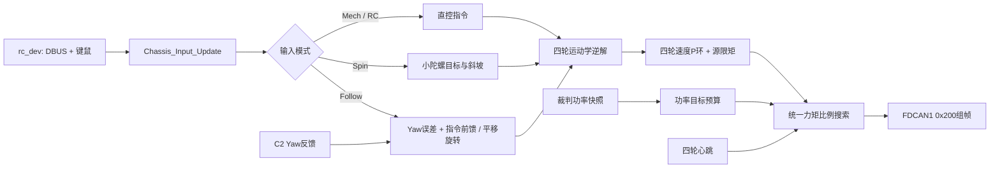

# 下板底盘输入、模式与四轮控制

[返回下板模块索引](README.md) · [返回下板工程说明](../Readme.md) · [遥控输入](remote.md) · [电机接口](motors.md) · [裁判功率数据](referee.md)

## 一拍控制顺序

调度入口为 `task_down/Application/TaskLayer/control_task.c`；输入/模式在 `chassis_input.c`、`chassis_follow.c`、`chassis_spin.c`，执行在 `chassis_control.c`。当前 `BOARD_COMM_DEBUG=1` 且 `CHASSIS_BRINGUP_ENABLE=1`，实际运行调试底盘链路。

## 输入选择与模式

- `CommandTask` 调用 `rc_interrupt_update()` 和 `keyboard_update()`；遥控器失联时 `Chassis_Input_Update()` 清空当前命令，键鼠也不继续使用旧帧。
- 遥控在线且 S1 上位时，按 F 上升沿切换键鼠输入源；Z/X/C 选择跟随/机械/小陀螺。非键鼠源时 S1/S2 档位控制跟随和小陀螺。
- 键盘 WASD 平移、Q/E 转向；Shift 乘 1.5，Ctrl 乘 0.5。机械键鼠档的鼠标 X 额外生成转向量，最大 ±15（控制域单位）。
- 跟随模式需要有效 C2 Yaw。平移向量按云台实际相对角旋转；旋转控制使用 Yaw 误差、死区、方向锁定、指令前馈和斜坡融合。
- 小陀螺目标旋转默认 25（控制域单位），每周期最多变化 0.1；退出时斜坡归零。平移允许按云台坐标系旋转，避免车头和云台方向脱钩。
- R 键在跟随机械档执行不同动作：机械档翻转软件前/后基准；跟随档运行 `IDLE → PREPARE → POSITION → RESTORE` 云台掉头。掉头等稳定反馈并等待通信交接；超时 2500 ms 会取消。

模式名称并不直接等同控制源。看 `chassis_cmd_t.source`、`valid`、`keyboard_source_active` 和各子模块 `selected/active/fault_latched` 判断当拍真正走的路径。

## 跟随闭环与故障锁存

跟随控制将 C2 机械 Yaw 映射到 [-π,π]，与当前前/后跟随中心比较形成角误差。普通跟随在误差进入 1°内时停止角度纠偏，停住后达到 2°才重新纠偏；1～2°保持原状态。主动转向时保留指令前馈。受扰和小陀螺退出回正使用独立 0.5°到位门限，到位后关闭辅助前馈并恢复普通 1°死区。超过 150°锁定转向方向，回到 20°内解锁。正常增益 20，输出限到 ±40 控制量，再用 10 ms 融合时间和每拍 0.4 控制量斜坡接入。

辅助回正前馈仅由以下条件触发：

- 无转向和平移输入、误差在 1°内、旋转输出归零、四轮反馈均低于既有 `CHASSIS_STOP_SPEED_BAND=1.0 rad/s`，持续 200 ms 后设置 `chassis_follow.disturbance_armed=1`；随后误差达到 6°，触发一次辅助前馈。该判据识别停稳后的偏离，不能区分外力来源。
- 小陀螺直接切跟随，设置 `recovery_pending=1`；等待小陀螺输出斜坡归零后，误差大于 0.5°就启用辅助前馈，即使此前已进入普通 1°死区。等待交接最多 4000 ms。
- 比例增益固定为原值 20。辅助前馈沿纠偏方向叠加，幅值为 `CHASSIS_FOLLOW_RECOVERY_FF_WZ=10.0` 转速控制量；7°及以上全幅，0.5～7°线性收小，0.5°以内为零。特殊回正穿过普通 1°死区，到 0.5°内结束；若持续 4000 ms 仍未到位则退出辅助，恢复普通跟随，超时不代表到位。总输出仍限于原 ±40 控制量。
- 主动摇杆/鼠标/QE 转向、R 掉头、跟随中心变化、退出跟随、无效指令或底盘故障会清除辅助前馈与停稳确认。普通转向松手后的追赶不直接触发辅助前馈。力矩、限功和反馈保护沿用原路径。

Keil Watch 可观察 `chassis_follow.correction_stopped`、`disturbance_armed`、`recovery_pending`、`recovery_active`（均为 0/1）以及 `yaw_error_rad`、`recovery_ff`（符号在最终旋转方向映射前，单位为转速控制量）。这些状态只描述软件控制阶段，效果需人工编译、烧录与台架验证。

C2 超过 50 ms、角度非法或相邻反馈跳变超过 30 deg 会使跟随故障锁存，并将命令标无效/清零。必须退出对应档位后才清除锁存条件；不要通过增大跳变门限或绕开 `cmd.valid` 来维持运动。

## 四轮控制与底盘保护

逆解分配为：

| 轮位 | 目标 |
| --- | --- |
| LF | `-vx + vy + wz` |
| LB | `-vx - vy + wz` |
| RF | ` vx + vy + wz` |
| RB | ` vx - vy + wz` |

当 `abs(vx)+abs(vy)+abs(wz)` 超过 `CHASSIS_CTRL_MAX_SPEED=80`，先限制旋转至总量的 60% 上限，再把剩余预算按比例分给平移。速度环当前纯 P，初始化从 `CHASSIS_SPEED_KP=0.8` 载入；输出上限按命令来源分别使用测试 2 N·m、跟随/小陀螺 4 N·m。目标/反馈进入零速带时清除 PID 状态，避免积分或微分残留。

运行前必须同时满足命令有效、底盘使能、vx/vy/wz 有限且四轮全在线。任一轮对象缺失、反馈离线、输入非法或输出接口异常都会停止并把四轮力矩清零；不能单轮失联继续闭环。

## 模式输入与目标生成

| 模式路径 | 旋转目标来源 | 平移坐标处理 | 主要退出/保护 |
| --- | --- | --- | --- |
| 遥控直控/机械 | 摇杆生成 vx/vy/wz；键鼠机械模式可叠加鼠标 X | 使用当前底盘控制坐标 | RC offline、命令无效或总使能关闭时清零 |
| 云台跟随 | C2 Yaw 误差 + 角速度前馈，含死区、方向锁和斜坡 | 按云台 Yaw 旋转平移向量 | 50 ms 超时、非法角度、30 deg 跳变触发锁存故障 |
| 小陀螺 | `CHASSIS_SPIN_BASE_WZ`，按每拍 step 平滑变化 | 配置为使用云台坐标系时旋转平移向量 | 退出后旋转目标斜坡回零；缺少新鲜 Gimbal 数据按配置处理 |
| 键鼠掉头 | R 键事件启动协同状态机 | 位置阶段根据目标角等待上板状态更新 | C2 无效、阶段超时或通信交接失败时取消/恢复 |

模式输入最后汇总为 `chassis_cmd_t`。观察每个子模块是否 `selected/active`，并确认命令 `source` 与 `valid`，比只看拨杆或按键更能说明当前控制分支。

## 功率限制路径

`CHASSIS_POWER_LIMIT_ENABLE=1`。CtrlTask 每轮先读裁判功率快照，再更新预算，速度环产生四轮候选力矩后由 `Power_Limit_Apply()` 做公共比例缩放。它保持四轮力矩比例，不独立削某一轮。

预算使用裁判底盘功率上限和 buffer energy：有效上限先减 5 W margin，buffer 低于 45 J 时增加强降额；buffer 目标 59 J，PI 参数用于预算调节，裁判帧缺失/过期/超出范围时回退 45 W。功率恢复只在新快照/活动条件下限速上升，降额立即生效。若零力矩估算仍超过预算或输出预测异常，则标记不可达并停输出。

超电反馈传给 `Power_Limit_SetCapFeedback()` 仅作状态观测；`SUPERCAP_CAP_SWITCH=0` 且该反馈不是限功闭环输入。功率估算依赖当前电机模型/反馈，并不等于裁判端实测或实车功率保证。

功率缩放发生在速度环和来源力矩限幅之后，因此“PID 输出很大而 CAN 命令较小”可能是公共 `scale` 的正常结果。若 `target_unreachable` 或预测值异常，需同时检查轮速反馈、电机模型输入、裁判快照和回退标志；不能只增加 PID 增益抵消限功。

## 调参入口

| 配置文件 | 参数 | 当前值/单位 |
| --- | --- | --- |
| `task_down/Application/ConfigLayer/chassis_config.h` | `CHASSIS_MAX_VX/VY/WZ` | 25 / 25 / 20，控制域量，不可直接标作 m/s 或 rad/s |
| 同上 | `CHASSIS_SPEED_KP/KI/KD` | 0.8 / 0 / 0，速度环纯 P；输出为 N·m |
| 同上 | 测试/跟随/小陀螺扭矩上限 | 2 / 4 / 4 N·m |
| 同上 | `CHASSIS_FOLLOW_KP`, `MAX_WZ` | 20 控制量/rad、40 控制量 |
| 同上 | `CHASSIS_FOLLOW_DEADBAND_DEG`, `RESUME_DEG` | 普通停止 1°、恢复 2° |
| 同上 | `CHASSIS_FOLLOW_RECOVERY_ARRIVE_DEG` | 特殊回正到位 0.5° |
| 同上 | `CHASSIS_FOLLOW_RECOVERY_FF_WZ` | 回正前馈幅值 10.0 转速控制量 |
| 同上 | `CHASSIS_FOLLOW_RECOVERY_TRIGGER_DEG`, `RECOVERY_FULL_DEG` | 受扰触发 6°、前馈全幅 7° |
| 同上 | `CHASSIS_FOLLOW_RECOVERY_STABLE_MS`, `RECOVERY_TIMEOUT_MS` | 停稳 200 ms、等待交接/辅助各 4000 ms |
| 同上 | `CHASSIS_FOLLOW_TIMEOUT_MS`, `YAW_JUMP_LIMIT_DEG` | 50 ms、30 deg |
| 同上 | `CHASSIS_SPIN_BASE_WZ`, `SPIN_STEP` | 25、0.1 控制域单位/周期 |
| `power_limit_config.h` | fallback/margin/guard/target | 45 W / 5 W / 45 J / 59 J |
| 同上 | `CHASSIS_POWER_BUFFER_KP/KI` | 2 W/J、0.5 W/(J·s) |

## 调试顺序

先观察 `rc_dev.work_state` 与 `chassis_input_cmd`，再看跟随/小陀螺状态、C2 时间戳和角度符号；最后查看 `chassis_ctrl.state.wheel_target[]`、轮速、各轮力矩以及 `power_limit_state.target_power/scale/fallback_used/target_unreachable`。从架空底盘的单方向低输出开始，确认物理方向和软件 LF/LB/RF/RB 对应关系后再联调功率模型。

## 按函数阅读控制与限功

| 阅读顺序 | 文件与函数 | 输入 → 输出 |
| --- | --- | --- |
| 1 | [control_task.c](../Application/TaskLayer/control_task.c) `StartCtrlTask()` | 输入更新 → 模式/执行/发射请求调度 |
| 2 | [chassis_input.c](../Application/ModuleLayer/chassis_input.c) `Chassis_Input_Update()` | RC/键鼠、模式 → `chassis_input_cmd` |
| 3 | [chassis_follow.c](../Application/ModuleLayer/chassis_follow.c) `Chassis_Follow_UpdateMode()` / `Chassis_Follow_Update()` | 选档、C2、操作速率 → 坐标变换与纠偏wz |
| 4 | [chassis_spin.c](../Application/ModuleLayer/chassis_spin.c) `Chassis_Spin_UpdateMode()` / `Chassis_Spin_Update()` | 选档与指令 → 旋转斜坡及平移变换 |
| 5 | [chassis_control.c](../Application/ModuleLayer/chassis_control.c) `Chassis_Control_Update()` | 指令/在线 → 预算、轮速目标与执行 |
| 6 | 同文件 `Chassis_Control_KinematicsInverse()` / `Chassis_Control_PidUpdate()` | 控制域vx/vy/wz → 四轮目标 → 候选力矩 |
| 7 | [power_limit.c](../Application/AlgorithmLayer/power_limit.c) `Power_Limit_GetTarget()` / `Power_Limit_Apply()` | 裁判快照/电机模型 → 预算和公共比例 |
| 8 | `Chassis_Control_Output()` / `Chassis_Control_Stop()` | 最终力矩 → RM组帧；异常时整组写零 |

### 功率预算的实际计算

有效裁判上限为 `limit_w` 时，基础预算 `base=max(20,limit_w-5)` W；缓冲值钳在0～60 J。缓冲误差 `e=max(0,59-buffer)` J，预算候选值为 `base-2·e-integral`。积分只随新的 `buffer_seq` 更新，时间步长取相邻接收时间差且最多200 ms，并有抗饱和处理；不能每1 ms重复积分同一裁判帧。

缓冲低于45 J时，预算上界为 `20+(base-20)·buffer/45` W。降额立即生效；恢复仅在活动且有新帧时最多按10 W/s增加。满缓冲且活动时，积分扣减按1 W/s释放，停车满缓冲不自动释放。快照失效时重置在线预算状态并回退45 W。

### 模型预测为什么采用公共比例

每轮用电流原始计数I和电机轴rpm代入 `k0+k1·I+k2·rpm+k3·I·rpm+k4·I²+k5·rpm²`。候选输出超预算时，对四轮共同比例进行10次二分搜索；得到比例后，按最终原始电流量化结果复算。这样保持候选力矩方向和相互配比，但不能保证实际轮速比例或整车轨迹精度。

`requested_power` 是候选功率预测，`estimate_power` 是最终输出预测，`target_power` 是预算，`scale` 是输出比例。零输出预测仍超预算时标记 `target_unreachable`，此时控制器没有凭空消除高速轮子的模型损耗，也不会额外增加制动力矩。

### 参数应按层定位

输入幅值/轮速环、跟随/小陀螺参数在 [chassis_config.h](../Application/ConfigLayer/chassis_config.h)；预算、缓冲PI和比例搜索在 [power_limit_config.h](../Application/ConfigLayer/power_limit_config.h)。几何长度、质量、轮半径虽然有配置，但当前四轮逆解直接按控制域组合，不使用这些参数完成标准SI运动学；讲解不能把控制量25直接称作25 m/s。

可用于讲解：“底盘先仲裁模式并处理云台坐标，再分配四轮目标；各轮速度P环生成力矩，裁判缓冲反馈和功率模型进一步决定整组输出比例。”
