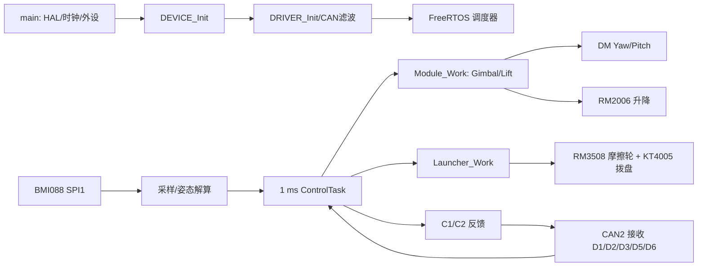

# 上板固件（STM32F407IGHx）

[返回项目总览](../README.md) · [下板工程](../task_down/Readme.md) · [上板模块目录](docs/README.md)

上板采集 BMI088 姿态数据，执行云台/升降/发射控制并通过 CAN2 接收下板命令、回传状态。Keil Target 为 `My_C`。

讲解项目时先读[项目讲解与源码速查](../README.md#项目讲解与源码速查)：包含双板分工、算法解释、参数数值、完整动作链和常见追问。本页继续提供上板启动与运行细节。

## 架构与启动



`main()` 的顺序是 HAL/系统时钟 → GPIO/DMA/SPI/TIM/CAN/UART/ADC → `DEVICE_Init()` → `DRIVER_Init()` → CAN 滤波 → 创建 RTOS 任务。HAL 初始化错误进入 `Error_Handler()`：关闭中断后停在循环，不提供统一错误码灯态。

## 工程结构与源码入口

```text
task_up/Application/
├─ ConfigLayer/      云台归中、升降、发射、板间开关
├─ DeviceLayer/      IMU、电机实例和传感器状态
├─ DriverLayer/      CAN/SPI/定时器等外设接口
├─ HardwareLayer/    DM、RM、KT 电机与 BMI088 驱动
├─ ModuleLayer/      Gimbal、Lift、Launcher 控制逻辑
├─ ProtocolLayer/    D/C 板间 CAN 解包、打包和分发
└─ TaskLayer/        ControlTask、MonitorTask、LedTask
```

| 源码入口 | 向下调用 | 主要副作用 |
| --- | --- | --- |
| `Core/Src/main.c` | HAL、时钟、GPIO/SPI/CAN/UART、设备与驱动初始化 | 外设初始化失败停在 `Error_Handler()` |
| `TaskLayer/control_task.c` | IMU 更新、`Module_Work()`、电机发送、`Launcher_Work()`、C1/C2 | 1 ms 主闭环 |
| `ModuleLayer/gimbal.c` | 目标选择、模式 FSM、两轴控制 | DM Yaw/Pitch 力矩 |
| `ModuleLayer/lift.c` | 找顶、行程控制、对齐互锁 | RM2006 力矩和 C1 状态 |
| `ModuleLayer/launcher.c` | 热量预算、发射状态、拨盘/摩擦轮 | RM3508/KT4005 输出 |
| `ProtocolLayer/communicate.c` | D1–D6 解包、C1/C2 打包、心跳 | CAN2 上下板数据交换 |

### 数据结构与跨模块接口

| 接口对象 | 生产方 → 消费方 | 检查重点 |
| --- | --- | --- |
| `Board_Rx_Info` | CAN2 解码 → 云台/升降/发射 | 分别检查 D1 状态、D2 目标、D3 热量和 D5 手动指令；D4 当前不提供有效血量消费 |
| `imu_dev` / `imu_data` | BMI088、坐标变换与 EKF → 云台 | 区分 `work_state` 在线/错误标志与 `base_info` 最近计算值 |
| `Gimbal` | 目标仲裁 + IMU/DM 反馈 → DM 电机命令、C2 | 检查运行模式、位置/速率目标、反馈和最终 torque 限幅 |
| `lift` | D1 `is_hole` + 云台姿态 + RM2006 → C1 byte 1 | `home_valid`、Pitch hold 和 fault code 不能由压缩后的 C1 单字段替代 |
| `launcher` / `launcher_heat` | D1/D5许可 + D3 + 电机反馈 → RM/KT | 区分总体 enable、热量 ready、摩擦轮 ready 和拨盘动作条件 |

不要把协议里的“请求位”、模块的“允许位”、最终电机“非零输出”合并看成同一状态。沿每个接口同时查看源数据、valid/status 和更新时间，才能确定停在哪一层。

上板模块页： [云台](docs/gimbal.md) · [升降](docs/lift.md) · [发射](docs/launcher.md) · [IMU](docs/imu.md) · [电机](docs/motors.md) · [通信](docs/board-link.md)。

| 任务 | 优先级 / 栈 | 调度与工作 |
| --- | --- | --- |
| ControlTask | `osPriorityRealtime` / 1024 | `osDelayUntil(..., 1)`；IMU → `Module_Work()` → DM 力矩发送 → 发射 → `Send_To_Down_Board()` |
| MonitorTask | `osPriorityRealtime` / 512 | 每轮 `osDelay(1)`；IMU、DM/RM/KT 电机、遥控及板间心跳 |
| LedTask | `osPriorityAboveNormal` / 256 | 启动绿灯常亮 500 ms，再持续绿灯闪烁 |
| CommunityTask | `#if 0` | 不创建 |

FreeRTOS tick 为 1 kHz；ControlTask 的控制步长目标 1 ms。MonitorTask 的 `osDelay(1)` 周期还包含任务运行时间。TIM2 为 HAL 1 ms timebase；TIM4 回调当前为空，不应当作控制调度器。

## 硬件与构建

| 项目 | 实际配置 |
| --- | --- |
| MCU / Keil Target | STM32F407IGHx / `My_C` |
| 编译器 | ARM Compiler 5.06 update 7（build 960）；工程定义 `__CC_ARM` |
| Device Pack | `Keil.STM32F4xx_DFP.2.17.1` |
| HAL / RTOS | 仓库内 STM32F4 HAL v1.8.3、FreeRTOS V10.3.1 |
| IMU | BMI088；SPI1 采集，经中间层和 EKF 姿态解算 |
| 电机实例 | DM Yaw/Pitch、RM2006 升降、RM3508 左右摩擦轮、KT4005 拨盘 |
| CAN | CAN1：PD0/PD1；CAN2：PB5/PB6；板间走 CAN2 |
| 上板本地遥控 | `GIMBAL_LOCAL_RC_ENABLE=0`；当前手动输入由下板转发 |
| GCC/Clang / 子模块 | 工程未配置 GCC/Clang；根目录无 `.gitmodules` |

在仓库根目录构建：

```powershell
UV4 -b task_up\MDK-ARM\My_C.uvprojx -t My_C -o "$env:TEMP\Train_code_plus_up.log"
Get-Content "$env:TEMP\Train_code_plus_up.log"
```

构建产物目录为 `task_up/MDK-ARM/My_C/`。项目未设置可复制使用的命令行 Flash Driver 参数；人工下载前需在 µVision 中选择实际 SWD 探针并配置匹配的 Flash Algorithm。下载或硬件行为未由构建结果验证。

## 核心控制实现

### 上板控制命令的来源

| 输入帧 | 字段进入点 | 对控制的影响 |
| --- | --- | --- |
| D1 | `Board_Rx_Info.state_pkt` / `shoot_pkt` | `car_state` 决定使能；`gimbal_mode` 选择 `G_MEC`/`G_RATE`；`is_hole` 请求升降；launch/mode/trigger 请求发射 |
| D2 | `Board_Rx_Info.gimbal_target_pkt` | 保存 IMU/机械角目标，具体字段是否消费取决于当前云台模式 |
| D3 | `Board_Rx_Info.heat_pkt` | 热量上限、当前热量、冷却率、数据来源序号和有效 flags |
| D5 | `Board_Rx_Info.remote_cmd_pkt` | 下板遥控角速度或鼠标增量；按来源/命令类型区分解释 |

`GIMBAL_LOCAL_RC_ENABLE=0`，上板本地遥控代码关闭。调云台输入时应从下板 UART5/DBUS、D5 组帧、FDCAN2/CAN2 接收、上板 `remote_cmd_pkt` 逐跳确认。

### IMU 到电机的闭环

`BMI088driver` 读取陀螺仪/加速度计 → `BMI088Middleware` 组织采样 → `bmi_EKF` 解算姿态 → `imu_sensor` 更新设备状态和角度/角速度 → `gimbal.c` 计算两轴控制量 → DM 电机输出力矩。姿态有效性需同时检查 `imu_dev.work_state`，不能只读角度字段。

`G_MEC` 中 Yaw 以机械位置误差生成速率目标，再经速度反馈/力矩控制；Pitch 与 `G_RATE` 共用角速度通路，包含操作输入与松杆保持。`G_INIT` 使用位置外环和速度内环，并受 6 N·m 力矩限幅。Pitch 重力补偿按 `K*cos(angle-middle)+bias` 计算；当前归中配置 `K=1.1 N·m`、偏置 `0 N·m`、开关为 1。

`G_RATE` 的 Yaw 速率输入松手后先以零速度目标制动，IMU 角速度连续 20 ms 小于 3 deg/s 后锁住实际朝向；制动最长 300 ms，超时也恢复角度保持。参数位于 `Application/ConfigLayer/gimbal_rate_config.h`，Watch 状态为 `Gimbal.feedforward.yaw_release.phase`（0 锁角、1 主动转向、2 制动）。

### 云台状态转移

| 状态 | 进入条件/行为 |
| --- | --- |
| `G_SLEEP` | 板间心跳非在线或 `car_state==0`；输出力矩清零并清除归中标志 |
| `G_INIT` | 安全条件恢复但尚未初始化；按机械角目标归中 |
| `G_MEC` | 初始化后 D1 `gimbal_mode==0`；机械模式 |
| `G_RATE` | 初始化后 D1 `gimbal_mode!=0`；手动角速度/自稳速控路径 |
| `G_GYRO` / `G_AUTO` | 枚举与控制分支存在，但当前 `gimbal_select_mode()` 不会选择 |

归中需位置误差、速度和目标稳定 30 ms；6000 ms 超时也会置 `init_flag=1`，所以该标志不证明实体已归中。模式切换时清 PID、目标对齐当前角并首帧置零力矩，避免切换瞬间沿用旧目标。

### 升降 FSM

`D1 b5 bit3` 的过洞请求进入上板；电机反馈、`home_valid`、请求边沿和云台对齐共同约束动作。

```text
LIFT_WAIT → LIFT_HOMING_UP → LIFT_READY_UP
LIFT_READY_UP → LIFT_ALIGN_DOWN → LIFT_MOVING_DOWN → LIFT_READY_DOWN
请求撤销时向上移动；超时/过流/越程可进入 LIFT_FAULT，堵转停止可进入 LIFT_STALL_STOP
```

| 参数/状态 | 实际含义 |
| --- | --- |
| `LIFT_TRAVEL_TURNS=280` | 电机圈数；换算 8192 count/圈，不是机构毫米 |
| `LIFT_HOME_TIMEOUT_MS=90000`、`LIFT_MOVE_TIMEOUT_MS=90000` | 找顶和单次运动超时 |
| C1 byte1=0/1/2/3 | 就绪/停止、运动中、上位等待/就绪、故障；值 2 不能代替 `home_valid` |
| `lift_debug.mode` | 手动调试路径；会绕开正常状态机的一部分动作判定 |

找顶用电流阈值并结合低速或位置停滞确认；当前完成后建立零点、生成上下目标，直接进入 `LIFT_READY_UP` 并卸力，没有进入保留的 `LIFT_RETRACT_DOWN` 回退分支。上端目标偏移 5 圈，下端目标偏移 280 圈，均相对 `top_zero`。常规下行对齐条件不满足会等待；已有零点的 `LIFT_WAIT` 下行分支可直接进入运动，不能将对齐描述成覆盖所有恢复路径。异常边界与调试变量见[升降模块说明](docs/lift.md)。

### 发射与热量 FSM

- 发射请求由下板D1发来，新单发还要求双轮达速及D6弹速路径有效；上一发漏发或未反馈不阻止下一发；连发以6000 rpm启动并参与三条有效反馈弹速修正，受弹速保护，见[单发弹速闭环](docs/launcher.md#单发弹速闭环)。
- 拨盘独立阶段见 `launcher_dial.state`：摩擦轮关闭、S2 中位时保持；过洞请求期间停机，退出请求后等待 `LAUNCHER_DIAL_HOLE_RELEASE_DELAY_MS=2000 ms` 恢复保持，不依赖升降到位或故障码。整车失能、断联、拨盘离线或发射机构故障时卸力，供弹仍受下板发射许可约束。
- 单发累加原目标，释放后完成本发；500 ms 未完成则制动后保持当前位置。启动发送失败最多等待 50 ms，拒绝/超时/许可中断后须释放再触发。
- 待发位置 KP=0.04、死区 100 count，速度 KP=0.15、KI/KD=0；单发和连发力度不变。拨盘与连发使能为 1，堵转退让为 0；主路径不进入旧 `SPINUP/INIT` 枚举值。
- 待发保持进入时立即发送力矩；运动或纠偏时按 `LAUNCHER_DIAL_HOLD_ACTIVE_TX_MS=1 ms` 发送，误差进入 100 count 死区且速度不超过 20°/s，连续 `LAUNCHER_DIAL_HOLD_IDLE_CONFIRM_MS=100 ms` 后按 `LAUNCHER_DIAL_HOLD_TX_INTERVAL_MS=10 ms` 发送。PID 计算与单发、连发、制动及摩擦轮/升降组帧周期不变。

热量训练模式关闭；有效 D3 到来前不建立发射预算。当前参数：每发估算热量 10、余量 20、连发恢复余量 30、最大射频 15 发/s、D3 超时 100 ms。失去许可进入减速/制动过程，不保证瞬时停转。完整状态与门槛见[发射模块说明](docs/launcher.md)。

## Protocol & Tuning

板间公共布局由[根 README](../README.md#protocol--tuning)维护；物理接口为下板 FDCAN2 ↔ 上板 CAN2，8 字节经典 CAN。此板接收 D1–D6，发送 C1/C2。

| 报文 | 本板处理 |
| --- | --- |
| D1 | 整车使能、云台模式、发射许可/触发、过洞请求 |
| D2 | 4 个线性映射角目标；实际使用取决于云台模式 |
| D3 | 热量上限/枪管热量/冷却率/源序号/有效 flags |
| D4 | 当前只更新心跳，不处理血量字段 |
| D5 | 角速度、输入来源和鼠标键；角速度量化步长 0.1 deg/s/LSB |
| D6 | 弹速0.01 m/s、uint16事件序号、源年龄ms、类型和机构编号 |
| C1 | 电机在线位和升降状态；剩余字段当前发 0 |
| C2 | Yaw/Pitch 机械角 rad 与 IMU 角 deg |

每类 C1/C2 最短发送间隔 `BOARD_FEEDBACK_PERIOD_MS=5`，以交替方式竞争 CAN 邮箱。入队成功不表示下板已收到；观察 `board_feedback_debug.c1/c2_ok_count`、失败/延后计数及下板心跳。

| 参数文件 | 常用参数（当前默认值） |
| --- | --- |
| `Application/ConfigLayer/gimbal_init_config.h` | 归中目标 0 deg；Yaw/Pitch 归中力矩上限 6 N·m；速度规划开关 0；超时 6000 ms |
| `Application/ModuleLayer/gimbal.h` | 控制步长 0.001 s；Yaw 静摩擦前馈 0.3 N·m；Pitch/Yaw 最终默认力矩限幅 6 N·m；重力补偿开关 1 |
| `Application/ConfigLayer/lift_config.h` | 下端目标距顶部零点 280 圈；找顶 2865 rpm；上端目标偏移 5 圈，当前找顶完成不自动回退；行程超时 90000 ms |
| `Application/ConfigLayer/launcher_config.h` | 基准6000 rpm；目标22 m/s；三发修正5400～6000 rpm；24 m/s锁止；射频上限15发/s；D3超时100 ms |
| `Application/ConfigLayer/board_remote_config.h` | 下板遥控输入开；本地遥控关闭；C1/C2 各自最短间隔 5 ms |

### 控制状态判读

| 现象 | 需要同时成立的条件 | 不能单独作为依据 |
| --- | --- | --- |
| 云台正在运行 | D1 心跳/`car_state` 有效、DM 与 IMU 在线、模式分支有有效目标 | `init_flag=1`（初始化超时分支也会置位） |
| D5 手动输入生效 | valid=1，source/type 与格式匹配，数据年龄可接受 | D5 心跳计数增长 |
| 升降下行开始 | 零点已建立、D1 请求有效、Yaw/速度对齐满足配置窗口、升降电机在线 | `is_hole=1` |
| 发射许可成立 | 板间/发射状态有效、双轮达速、热量和D6弹速路径有效、拨盘条件满足 | 单发不等待上一发弹速；漏发/超时仅清空学习；`launcher_speed.block_reason`及拨盘拒绝原因 |

详细条件、状态枚举和变量路径分别见[云台](docs/gimbal.md)、[升降](docs/lift.md)和[发射](docs/launcher.md)。建议先按模块页定位软件状态，再核实驱动器反馈和机械状态。

## Troubleshooting & Safety

### Keil Watch 观察入口

| 变量/结构 | 用途 |
| --- | --- |
| `Gimbal.gimbal_mode` / `Gimbal.init_info.init_flag` | 当前模式及归中状态；init flag 不是实体归中证明 |
| `Gimbal.base_info.yaw_mec_angle/pitch_mec_angle` | 机械角度（deg），与协议传出的 rad 区分 |
| `imu_dev.work_state`、`imu_dbg` | IMU 在线、错误/校准、姿态更新 |
| `lift.state/home_valid/fault_code` | 升降当前状态、零点有效性、故障原因 |
| `launcher.state/launcher_heat` | 发射阶段、热量数据源、预算是否有效/阻塞 |
| `Board_HeartBeat`、`board_feedback_debug` | D1/D2 接收心跳及 C1/C2 本地发送结果 |

调试时先确定数据是否新鲜，再看控制器输入/输出；角度变量保留着旧值不代表传感器仍在线。

| 检查项 | 代码判据/动作 |
| --- | --- |
| 板间离线 | `Board_HeartBeat.status` 由 D1/D2 计数更新；云台在离线时休眠、输出置零 |
| IMU 状态异常 | `ControlTask` 仅在错误码为 none/cali 时调用 `imu_dev.update()`；观察 `imu_dbg`、错误码、校准状态 |
| 电机离线 | MonitorTask 更新 DM/RM/KT 在线状态；C1 汇报主要电机位；电机类型的温度/错误字段须按驱动单独检查 |
| 升降故障 | `LIFT_FAULT`/`LIFT_STALL_STOP` 输出为零；观察 `fault_code`、`home_valid`、编码器、C1 byte1 |
| 热量/拨盘异常 | D3 flags 与新鲜度决定热量数据是否可用；堵转自动退让开关默认关闭；观察 `launcher_heat.source/ready/blocked` |
| HAL 初始化失败 | `Error_Handler()` 关中断停机，没有可读启动错误灯码 |

首次上电卸弹并清空拨盘，抬离底盘轮、确认云台和升降无机械障碍；先核对 BMI088 方向、电机反馈/方向、上下板心跳，再以低输出逐轴验证。归中超时可能自动退出到后续模式；必须核对实际机械位置，不得仅凭 `init_flag` 开始高速测试。

模块细节：[云台](docs/gimbal.md) · [升降](docs/lift.md) · [发射](docs/launcher.md) · [电机](docs/motors.md) · [IMU](docs/imu.md) · [板间通信](docs/board-link.md)
