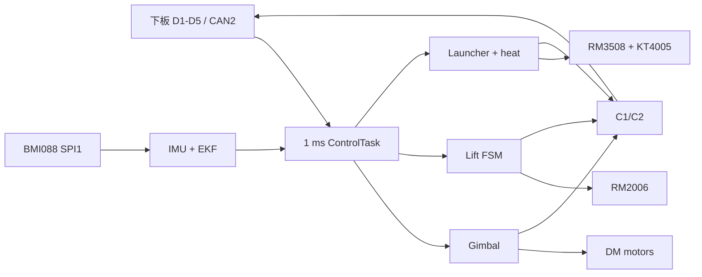

# 上板模块文档

[返回上板工程说明](../Readme.md) · [返回项目总览](../../README.md)

本目录对应 STM32F407 上板运行链路。任务入口在 `Application/TaskLayer/control_task.c`；模式/状态控制位于 ModuleLayer，器件采集和电机协议位于 DeviceLayer/HardwareLayer。

| 模块 README | 重点 |
| --- | --- |
| [云台](gimbal.md) | G_SLEEP/G_INIT/G_MEC/G_RATE 仲裁、级联控制、Pitch 重力补偿 |
| [升降机构](lift.md) | 找顶、零点有效性、对齐/行程、故障和 C1 状态 |
| [发射与热量](launcher.md) | 摩擦轮/拨盘状态、D3 新鲜度、预算与限频 |
| [电机](motors.md) | DM/RM/KT 实例、CAN、单位转换和在线状态 |
| [IMU](imu.md) | BMI088 SPI、EKF、姿态单位和校准状态 |
| [板间通信](board-link.md) | D1–D5 接收、C1/C2 回传与有效性 |

## 推荐阅读路线

| 调试目的 | 阅读路线 | 关键状态/变量 |
| --- | --- | --- |
| 上电后云台不动 | [板间通信](board-link.md) → [IMU](imu.md) → [电机](motors.md) → [云台](gimbal.md) | D1 heartbeat、`imu_dev.work_state`、DM online、`Gimbal` mode/output |
| 云台跟手或归中异常 | [云台](gimbal.md) → [IMU](imu.md) → [电机](motors.md) | D5 `valid/source/cmd_type`、目标/反馈单位、力矩限幅 |
| 升降没有响应 | [升降](lift.md) → [板间通信](board-link.md) → [云台](gimbal.md) | `home_valid`、`fault_code`、`is_hole`、Pitch/Yaw 对齐条件 |
| 拨盘拒绝供弹 | [发射](launcher.md) → [板间通信](board-link.md) → [下板裁判](../../task_down/docs/referee.md) | D1许可、D3 flags/age、`launcher_heat.source/ready/blocked` |

## 公共时序与单位约定

- ControlTask 以 1 ms 节拍运行；IMU 任务调用频率不等于 BMI088 实际数据采样率。
- 云台算法中的 IMU角/手动角速度主要使用 deg、deg/s；DM 电机反馈位置接口使用机械角换算，协议 C2 对机械角映射为 rad。
- 升降位置状态使用 encoder count，RM 电流字段是驱动原始计数；任何 count→mm 或 raw→A 换算都需要机构/驱动参数依据。
- `G_INIT` 的状态标志需与到位误差、速度和稳定计时一起看；超时完成不代表机构已经到达安全机械中心。

模块页中的当前宏值是源码默认值；若运行时 Watch 改写了 RAM 参数，实际控制值可能与编译默认值不同。

调参前先确认模块运行状态、反馈单位和设备在线状态；上电测试安全步骤见[上板 README](../Readme.md#troubleshooting--safety)。
