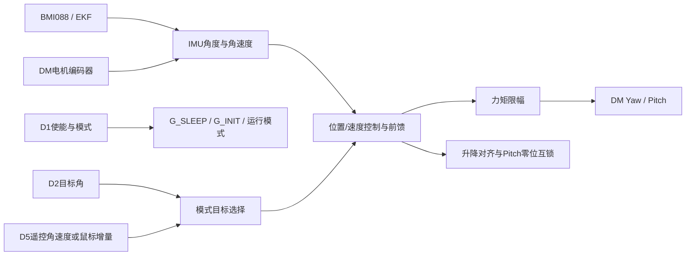

# 上板云台控制

[返回上板模块索引](README.md) · [返回上板工程说明](../Readme.md) · [协议字段](board-link.md)

## 控制链路

主实现为 `task_up/Application/ModuleLayer/gimbal.c`、`gimbal.h`。`control_task.c` 每 1 ms 更新传感器和模块；设备初始化、DM CAN 收发及在线状态分别由 `DeviceLayer/motor.c` 和 `HardwareLayer/DM_Motor.c` 管理。

## 模式状态与选择

| 状态 | 进入/退出条件 | 实际动作 |
| --- | --- | --- |
| `G_SLEEP` | 板间心跳离线或 D1 `car_state==0` | 两轴输出清零并撤销初始化完成标志 |
| `G_INIT` | 安全条件恢复且尚未完成初始化 | 以机械目标归中；位置误差、速度和稳定时间均参与完成判定 |
| `G_MEC` | `init_flag` 有效且 D1 `gimbal_mode==0` | Yaw 机械位置保持；Pitch 使用速率通路和机械限制 |
| `G_RATE` | `init_flag` 有效且 D1 `gimbal_mode!=0` | 操作角速度指令进入速率闭环，松杆时位置保持环接管 |
| `G_GYRO`、`G_AUTO` | 枚举/分支存在 | 当前选择函数没有由 D1 选入这两个模式 |

`G_INIT` 稳定阈值为 30 ms，最长等待 6000 ms。超时分支也会置 `init_flag`，因此“初始化完成”不能单独证明云台已到机械零位。板间失联恢复后会重新初始化；检查实际编码器角和机构空间后再允许高速动作。

模式切换清理相关 PID 状态并对齐目标，切换首周期置零输出。手动输入源由 D5 的来源位区分遥控/键鼠；协议支持鼠标增量格式，但当前下板键鼠路径发送角速度格式，量化单位为 0.1 deg/s/LSB。`GIMBAL_LOCAL_RC_ENABLE=0`，当前上板不直接启用本地遥控输入。

## 两轴闭环与补偿

- **Yaw 机械保持**：机械角误差经软死区和计数域位置环形成速率目标，IMU 角速度用于内环反馈；内环反馈另有速度死区。当前补偿路径由 IMU/电机相对速率之差估计底盘旋转，再滤波、渐入前馈；头文件中的静摩擦参数不等于本路径必然叠加静摩擦力矩。
- **速率与松杆保持**：操作速率幅值低于 2 deg/s 时保持环进入；高于 8 deg/s 时完全交还手动输入，中间区域用于平滑接管。Yaw、Pitch 保持环参数分别配置。
- **Pitch 输出**：速率控制结果与重力补偿合成后再限矩；重力项使用中点角、正负方向、幅值和偏置，不是固定常数。
- **单位边界**：IMU角度及人工输入命令使用 deg、deg/s；机械位置控制接口有 deg/rad 转换；DM 输出为 N·m。跨协议字段请以[板间协议页](board-link.md)的映射范围为准。

## 常用配置与调参入口

| 文件/宏 | 当前值 | 作用与单位 |
| --- | --- | --- |
| `ConfigLayer/gimbal_init_config.h`：`GIMBAL_INIT_*_HOME_DEG` | Yaw/Pitch 均 0 deg | 初始化目标；机械中点仍需与实物标定对应 |
| `GIMBAL_INIT_TIMEOUT_MS` / `GIMBAL_INIT_STABLE_MS` | 6000 / 30 ms | 初始化等待上限与连续稳定时间 |
| `GIMBAL_INIT_*_MAX_RATE_DEG_S` | Yaw 200、Pitch 45 deg/s | 归中目标速率限制；速度规划开关当前为 0 |
| `GIMBAL_INIT_*_TORQUE_LIMIT_NM` | 两轴 6 N·m | 初始化状态力矩限幅 |
| `GIMBAL_INIT_PITCH_GRAVITY_*` | 开启；K=1.1 N·m、B=0 N·m、中点 0 deg | Pitch 余弦重力补偿参数 |
| `gimbal.h`：`GIMBAL_YAW_MIDDLE_DEG` / `GIMBAL_PITCH_MIDDLE_DEG` | -22.224138 / 148.573157 deg | 当前机械中点常量；与归中目标不是同一组参数 |
| `GIMBAL_TORQUE_LIMIT` | 6 N·m | 运行输出最终限幅 |
| `GIMBAL_RATE_HOLD_ENTER_DEG_S` / `GIMBAL_RATE_HOLD_EXIT_DEG_S` | 2 / 8 deg/s | 速控松杆保持环接管门限 |

运行控制中较常观察的参数（均定义在 `task_up/Application/ModuleLayer/gimbal.h`）：

| 参数 | 当前值 | 作用/单位 |
| --- | ---: | --- |
| `GIMBAL_MANUAL_YAW_RATE_DEG_S` / `...PITCH...` | 200 / 150 deg/s | 摇杆满量程映射到的速率上限 |
| `GIMBAL_RC_AXIS_MAX` / `GIMBAL_RC_AXIS_DEADBAND` | 660 / 20 | 摇杆归一化满量程和死区 |
| `GIMBAL_MOUSE_YAW/PITCH_DEG_PER_COUNT` | 0.04 / 0.04 deg/count | 鼠标位移到目标角增量 |
| `GIMBAL_RATE_CMD_RAMP_DEG_S_PER_MS` | 6 deg/s/ms | 速率命令斜坡变化限制 |
| `GIMBAL_MEC_YAW_MAX_RATE_DEG_S` | 300 deg/s | 机械 Yaw 运动目标限速 |
| `GIMBAL_MEC_YAW_FRICTION_FF_NM` | 0.3 N·m | 保留调参值；当前统一机械定位函数未消费此项 |
| `GIMBAL_YAW_HOLD_KP/KI` | 20 / 0.003 | Yaw 位置保持 PI；输出 deg/s |
| `GIMBAL_PITCH_HOLD_KP/KI` | 50 / 0 | Pitch 位置保持 PI；输出 deg/s |
| `GIMBAL_MEC_HOLD_KP_NM_PER_DEG` | 1.5 | 宏名保留旧单位；当前作为计数域位置环增益使用 |
| `GIMBAL_MEC_HOLD_RATE_KP_NM_PER_DPS` / `GIMBAL_MEC_HOLD_RATE_OUT_MAX_NM` | 0.1 / 6.0 | 机械 Yaw 速度内环增益 / 输出限幅 N·m |

归中状态使用 `gimbal_init_config.h` 另设四个位置/速度环（Yaw 外环 Kp/Kd=0.1/1.0、输出上限 500；Yaw 内环 Kp/Kd=1.5/0.2、输出上限 100；Pitch 外环 Kp=1.6、输出上限 10；Pitch 内环 Kp=1.2、输出上限 10）。这些数值是控制器内部输出域，最后仍由两轴 6 N·m 限幅约束；不应仅凭表中 PID 输出上限推导实际电机力矩。

角速度指令/保持 PID 的增益单位随控制误差和输出单位组合变化，不能跨 P/I/D 项直接比较数值。模式目标首先以deg表示，机械Yaw定位函数再转计数域；电机输出力矩最终经过N·m限幅。

当前值不等于已完成实车标定。尤其机械中点、Pitch 行程端点、重力方向和力矩限幅需按实际机构确认。

## R掉头专用参数

- 配置文件：`Application/ConfigLayer/gimbal_turn_config.h`。
- `GIMBAL_R_TURN_YAW_MAX_RATE_DEG_S = 1000.0f`：R掉头最大目标角速度，deg/s。
- `GIMBAL_R_TURN_YAW_RAMP_DEG_PER_MS = 1.5f`：R掉头目标斜坡，deg/ms。
- 下板D1 b5 bit4传递R掉头状态，仅上板机械Yaw分支消费；普通机械定位保留当前斜坡和原最大速度，归中参数不变。
- 跟随R沿用原状态机；机械R在误差≤0.5°持续100 ms后退出专用参数。超时2500 ms、反馈失效、退出机械模式或过洞请求均退出专用参数，继续服从原控制逻辑。
- 两板需同步更新；最大速度仍受制动曲线、近点限速、PID和力矩限幅约束。

## 排查顺序

1. 看 `Board_HeartBeat.status` 和 D1 `car_state`，确认不是 `G_SLEEP` 保护。
2. 看 IMU error/cali 状态、`imu_dev.work_state`、两轴编码器和电机在线位，避免用 PID 掩盖无效反馈。
3. 对照 `Gimbal` 当前模式、目标角/角速度、位置误差、内环反馈与最终力矩，分清目标没有到达还是输出受限。
4. 速控漂移检查 D5 `valid/source/cmd_type`、控制方向和松杆接管阈值；Pitch 下垂检查重力补偿符号/中点。
5. 检查 C1/C2 心跳和发送计数；MCU 入队成功不等于下板收到。

调试观察入口：`Gimbal`、`gimbal_feedforward`、`gimbal_init_info`、`imu_dbg`、`Board_Rx_Info.remote_cmd_pkt`、`board_feedback_debug`。首次调试卸除弹丸、限制力矩并留出两轴全行程空间。

### 目标到输出的 Watch 路径

| 顺序 | 建议字段 | 用途 |
| --- | --- | --- |
| 1 | `Board_HeartBeat.status`、`Board_Rx_Info.state_pkt.car_state` | 判断是否被 `G_SLEEP` 保护 |
| 2 | `Gimbal.gimbal_mode`、`init_info.init_flag` | 确认选中模式与归中状态，必要时查超时标志 |
| 3 | `Gimbal.base_info`、`Board_Rx_Info.gimbal_target_pkt`、`remote_cmd_pkt` | 对照角度单位、角速度、机械目标与手动输入 |
| 4 | 位置/速度误差、hold 状态、feedforward | 分辨目标生成、反馈方向和保持/补偿分支 |
| 5 | `tx_info.torque`、DM 反馈与 CAN 发送状态 | 判断是否在软件限幅后仍有命令以及反馈是否跟随 |

字段层级按 `gimbal.h` 当前结构定义核实。若只观察最终 torque，无法区分“目标未生成”“反馈无效”“输出被限幅”或“驱动器未执行”。

## 按函数阅读实际实现

| 阅读顺序 | 文件与函数 | 重点理解 |
| --- | --- | --- |
| 1 | [gimbal.c](../Application/ModuleLayer/gimbal.c) `Gimbal_Init()` / `gimbal_pid_init()` | 绑定电机、装载 `gimbal_tune`、归中参数与 PID；区分初始化参数和运行时修改值 |
| 2 | 同文件 `Gimbal_Work()` / `gimbal_info_update()` | 机械反馈与 IMU 同步到 `base_info`，处理安装零位和角度单位 |
| 3 | `gimbal_select_mode()` / `gimbal_update_targets()` | D1 决定模式，D2 提供机械目标，模式切换与 R 斜坡影响实际目标 |
| 4 | `gimbal_manual_input_update()` / `gimbal_update_rate_targets()` | D5 类型解析后生成操作速率与松杆保持目标；Pitch 零位互锁会影响目标 |
| 5 | `gimbal_mec_yaw_calc()` | 最短角误差、计数换算、软死区、近端限速、速度 PID 与底盘速率前馈 |
| 6 | `gimbal_calc_output()` | 分模式执行控制，叠加 Pitch 重力和力矩前馈，最后限矩 |
| 7 | [control_task.c](../Application/TaskLayer/control_task.c) `gimbal_can_send()` | 输出到 DM；车辆失能/断联时发送卸力路径 |

### 机械 Yaw 的计算步骤

1. 对目标与实际机械角之差取最短角，再乘 `GIMBAL_DEG_TO_COUNT=182.04 count/deg`。
2. 裁剪位置软死区；由剩余角误差计算制动速度上限，并叠加近端比例速度限制。
3. 计数域位置 PID 给出速度命令，经 `GIMBAL_COUNT_TO_DEG_S` 命令比例转换进入 deg/s 域。
4. `chassis_rate = IMU_rate - relative_motor_rate`；以 0.05 更新系数低通，25～35 deg/s 渐入前馈，最大倍率 0.90。
5. IMU 速度反馈进入独立 10 deg/s 死区后送速度 PID，输出限幅，再由机械 Yaw 力矩斜坡接入。

IMU 离线时该定位函数清 PID 并返回零；恢复首轮对齐误差历史，减少微分突跳。速度死区只作用于送内环的反馈副本，底盘速率估计仍用原反馈，避免在阈值处破坏前馈估计。

### 速控模式和机械模式不要混讲

| 路径 | 位置/保持输入 | 速度反馈 | 参数入口 |
| --- | --- | --- | --- |
| 机械 Yaw | D2 机械目标与电机机械角，内部转 count | IMU Yaw deg/s | `gimbal_tune` 的机械保持项；旧 `yaw_mec_outer/inner` 初始化值不是当前统一定位律 |
| 速控 Yaw | D5 速率与 IMU 角度保持修正 | IMU Yaw deg/s | `yaw_hold` 与 `yaw_gyro_inner`，速度 KP=0.04 |
| 运行 Pitch | D5 速率、角度保持和升降零位请求 | 电机机械速度由 rad/s 转 deg/s | `pitch_hold` 与 `pitch_gyro_inner`，速度 KP=0.03 |
| 初始化两轴 | 机械角归中目标 | 机械速度 | [gimbal_init_config.h](../Application/ConfigLayer/gimbal_init_config.h) |

可用于讲解：“云台按模式使用不同目标和反馈，机械 Yaw 是编码器位置外环加 IMU 速度内环；速控时操作输入与松杆保持共同生成目标速度，Pitch 再加重力补偿。”
