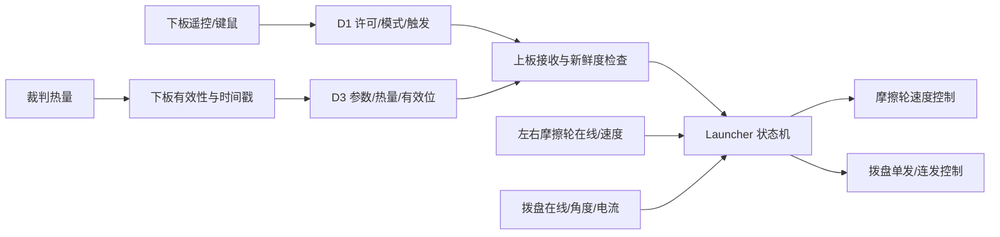

# 上板发射机构与热量预算

[返回上板模块索引](README.md) · [返回上板工程说明](../Readme.md) · [裁判数据链路](../../task_down/docs/referee.md) · [板间帧定义](board-link.md)

## 上下板职责和执行器链路

下板 `task_down/Application/ModuleLayer/launch.c` 读取遥控/键鼠输入，将使能、模式和触发整理进 D1；上板 `task_up/Application/ModuleLayer/launcher.c` 决定摩擦轮、拨盘状态和是否允许供弹。热量快照从裁判系统解析后，经 D3 传给上板。D1 请求不等于实际供弹许可：上板总使能要求板间在线、launch_state 有效且左右摩擦轮电机在线；拨盘动作还要求拨盘在线和热量预算有效。

执行器：左右 RM3508 摩擦轮、KT4005 拨盘。设备实例、反馈字段和 CAN 映射见[上板电机](motors.md)。

## 状态与许可条件

| 状态 | 主要作用 | 关键转移条件 |
| --- | --- | --- |
| `LAUNCHER_SLEEP` | 休眠、输出关闭 | 当前主路径收到使能后重采样拨盘角并进入 `READY` |
| `LAUNCHER_SPINUP` | 预留摩擦轮升速状态 | 状态分支存在；当前正常使能路径不赋值进入该状态 |
| `LAUNCHER_INIT` | 预留拨盘初始定位状态 | 自动归零宏关闭，当前正常使能路径不进入该状态 |
| `LAUNCHER_READY` | 等待单发或连发输入 | 单发上升沿/连发请求还需热量许可 |
| `LAUNCHER_SINGLE` | 执行一发位置动作 | 拨盘完成目标或超时后回到待发/安全停机 |
| `LAUNCHER_REPEAT` | 按射频和预算连续供弹 | 请求撤销、热量不足或设备条件失效时退出 |
| `LAUNCHER_REVERSE` / `LAUNCHER_RELOAD` | 堵转退让与恢复定位 | 仅在堵转功能启用时有运行意义 |
| `LAUNCHER_STOPPING` | 撤销许可后的降速/制动 | 摩擦轮降至停止速度或停机条件结束 |
| `LAUNCHER_FAULT` | 故障分支 | 当前实现保留处理分支；静态搜索未见正常路径设置该状态 |

当前 `LAUNCHER_DIAL_ENABLE=1`、`LAUNCHER_REPEAT_ENABLE=1`；自动归零 `LAUNCHER_DIAL_AUTO_RESET_ENABLE=0`，堵转检测/退让 `LAUNCHER_DIAL_JAM_ENABLE=0`。因此枚举中存在 SPINUP/INIT/REVERSE/RELOAD 不代表这些分支当前会按预想顺序运行；堵转恢复也未开启。

摩擦轮达速由 `fric_ready` 根据两轮反馈误差和连续时间计算（容差 500 rpm、100 ms），但当前 `Launcher_Work()` 的正常使能路径没有把 `fric_ready` 作为单发供弹的硬门槛。它是观测状态，不能据此推断“达速前拨盘被代码互锁”。这一区别应在实际发射联调前人工确认是否符合预期。

## 热量数据如何限制供弹

D3 包含热量上限、当前枪管热量、冷却率、源序号和两类有效标志。上板收到帧只刷新接收时刻，不会自动将热量标成有效；热量参数和枪管热量分别判有效，并有 `LAUNCHER_HEAT_D3_TIMEOUT_MS=100 ms` 的新鲜度限制。

热量来源状态有 `NONE`、`REFEREE`、`ESTIMATE`、`TRAINING`。训练固定参数当前关闭；`NONE` 尚未建立可用基准时不会按“零热量”放行。运行中根据单发热量预占、冷却率、剩余量、射频上限和恢复门槛更新预算。收到无效/过期数据时观察 `launcher_heat.source/ready/blocked`，不要只看 D3 CAN 心跳。

| 配置 | 当前值 | 单位/意义 |
| --- | ---: | --- |
| `LAUNCHER_HEAT_PER_SHOT` | 10 | 每发预算增加量，裁判热量单位 |
| `LAUNCHER_HEAT_WARN` | 200 | 热量接近上限时的降速起点 |
| `LAUNCHER_HEAT_SATURATE` | 50 | 预算速率调节的平衡区起点 |
| `LAUNCHER_HEAT_MARGIN` / `STOP` | 20 | 供弹安全余量；`STOP` 与 `MARGIN` 同值 |
| `LAUNCHER_HEAT_RESUME` | 30 | 热停发后恢复余量 |
| `LAUNCHER_HEAT_MAX_RATE` | 15 | 连发上限，发/s |
| `LAUNCHER_HEAT_D3_TIMEOUT_MS` | 100 | D3 最大允许陈旧时间 |

裁判串口、快照与 D3 的产生条件见[下板裁判系统文档](../../task_down/docs/referee.md)。D4 血量透传与上板供弹预算无关。

## 摩擦轮与拨盘配置

配置入口：`task_up/Application/ConfigLayer/launcher_config.h`。

| 参数 | 当前值 | 单位/控制意义 |
| --- | ---: | --- |
| `LAUNCHER_FRIC_TARGET_RPM` | 1500 | 左右摩擦轮目标转速 |
| `LAUNCHER_FRIC_RAMP_RPM_PER_MS` | 20 | 升速斜坡变化量 |
| `LAUNCHER_FRIC_READY_TOL_RPM` / `READY_TIME_MS` | 500 / 100 | `fric_ready` 观测判据；当前不是拨盘供弹硬互锁 |
| `LAUNCHER_FRIC_OUT_MAX` | 5000 | 摩擦轮 PID 原始输出限幅 |
| `LAUNCHER_DIAL_ONE_SHOT_ANGLE` | 65536 | 单发拨盘累计角目标，count |
| `LAUNCHER_DIAL_SINGLE_TIMEOUT_MS` | 500 | 单发动作超时 |
| `LAUNCHER_DIAL_REPEAT_SPEED_DPS` | 6000 | 连发拨盘目标速度，内部 dps |
| `LAUNCHER_DIAL_CURRENT_LIMIT` | 2000 | 拨盘电流限制原始量，不是 A |
| `LAUNCHER_DIAL_MAX_SPEED_DPS` | 7000 | 拨盘最大速度，内部 dps |
| `LAUNCHER_DIAL_JAM_CONFIRM_TICKS` | 200 | 堵转确认周期；当前堵转开关关闭 |
| `LAUNCHER_DIAL_BRAKE_TIMEOUT_MS` | 120 | 拨盘制动等待上限 |

拨盘位置采用累计 count，不应直接将 65536 count 解释成一整圈或机构角度；换算关系由 KT 驱动和拨盘控制共同决定。在线调参对象及 `launcher_heat` 观测字段在 `launcher.h`。

## 调试入口与安全

按此顺序区分问题：

1. `launcher.state/enabled`：确认下板许可、模式和触发沿已进入上板。
2. `launcher_heat.source/ready/blocked` 与 D3 `flags/rx_tick/heat_seq`：确认预算有效且不过期。
3. 左右摩擦轮在线状态、`fric_l/r.speed_rpm` 和 `fric_ready`：确认两轮都达到速度窗口。
4. 拨盘在线、累计角、目标角、当前状态和故障位：确认单发目标及停止条件。
5. 查看 CAN 组帧和驱动反馈；电机在线心跳不能单独证明弹丸/机械动作已完成。

首次联调必须卸弹、清空拨盘弹道并将摩擦轮与拨盘分阶段测试；失去许可时 `LAUNCHER_STOPPING` 包含降速/制动过程，不保证输出瞬间归零。热量参数不是实际裁判端校验结果，射频/电流阈值必须按实物与规则人工确认。

### 请求到拨盘的判定链

| 检查点 | 代码意义 | 失败时应检查 |
| --- | --- | --- |
| D1 `launch_state` 与 `shoot_mode/level` | 下板当前请求、模式和触发电平 | 下板输入源、D1 b5 位域与上板 `Board_Rx_Info.shoot_pkt` |
| 总体 launcher enable | 结合板间在线、许可有效、左右摩擦轮在线 | 心跳、发射状态、左右摩擦轮 C1 位及上板本地电机状态 |
| 热量预算可用 | 热量源有效且 D3 flags、年龄符合上板限制 | 下板裁判 `seen/tick`、D3 flags、上板 D3 `rx_tick` |
| 触发被接受 | 单发边沿或连发请求进入相应分支 | `shoot_level` 边沿、模式值和 repeat 开关 |
| 拨盘执行 | 拨盘在线且状态机输出位置/速度目标 | KT4005 累计角、速度、电流原始量和驱动响应 |

`fric_ready` 是观测判据，不是当前单发/连发的统一硬门槛；源码状态机的具体许可点应以 `Launcher_Work()` 当前路径为准。单独看到 `launch_state=1`、D3 收帧或摩擦轮在线都不足以证明拨盘应当动作。

### 失能后的输出行为

进入 `LAUNCHER_STOPPING` 后，摩擦轮按 `LAUNCHER_FRIC_STOP_RAMP_RPM_PER_MS` 斜坡减速，并结合停止速度和持续确认时间结束停止流程。该处理与立即清零力矩不同；急停/断电行为由外部硬件和驱动器决定，软件停机状态不能代替急停回路。
