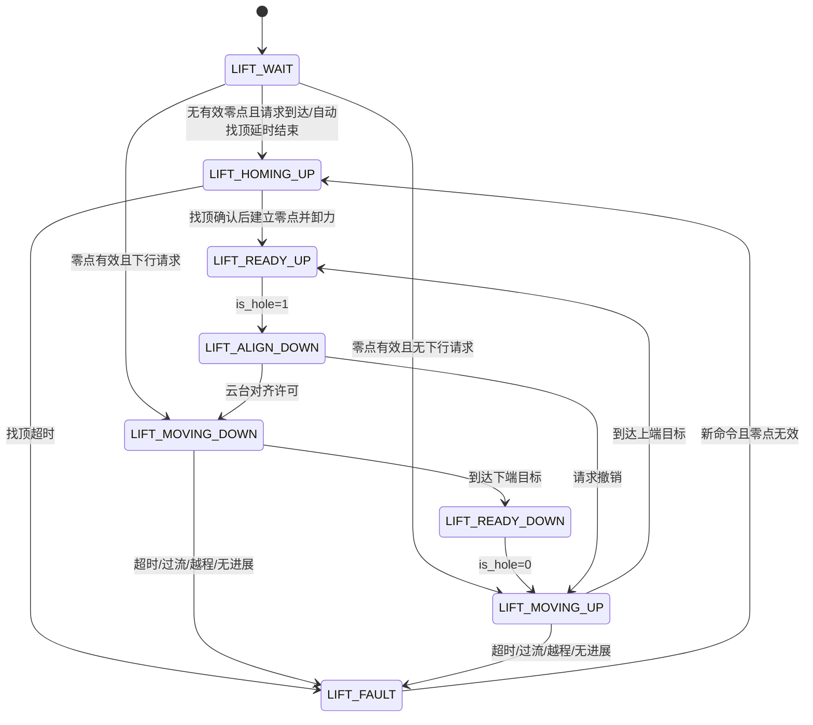

# 上板升降机构控制

[返回上板模块索引](README.md) · [返回上板工程说明](../Readme.md) · [板间帧定义](board-link.md)

## 按函数讲解实现

| 文件与函数 | 解决的问题 | 主要输入输出 |
| --- | --- | --- |
| [lift.c](../Application/ModuleLayer/lift.c) `Lift_Init()` | 绑定 RM2006、配置调参对象与状态 | 建立 `lift`、`lift_tune`、PID 与初始化时间 |
| `Lift_Work()` | 每轮选择状态、接收请求边沿、处理失能 | D1、电机在线/反馈 → 当前状态、目标和输出 |
| `lift_homing_up_update()` | 识别机械顶部并建立零点 | 原始电流、rpm、位置进展 → `top_zero/home_valid` |
| `lift_alignment_ok()` | 常规下行前核对云台姿态/速率 | 机械角、IMU/电机状态 → 对齐许可 |
| `lift_output_position_limited()` | 编码器位置双环与幅值限制 | 位置误差 count → 速度目标 rpm → rad/s 速度环 → 原始输出 |
| `lift_move_update()` / `lift_move_stalled()` | 到位、越程、运动超时和无进展判定 | 位置、速度、电流、计时 → READY 或保护状态 |
| `Lift_Get_Report_State()` | 将本地状态压缩进 C1 | 内部 FSM → 0/1/2/3；不传完整故障码 |

### 双环、位置基准与量纲

- 位置环在编码器 count 域计算；默认 `KP=0.0064`，输出按 rpm 目标解释，并限制最低运动速度和最高速度。
- 速度目标和 `encoder_speed` 反馈都经 `rpm·2π/60` 转成 rad/s 后进入速度 PID。配置注释中的 rpm 增益名称不能替代消费函数的实际量纲。
- 速度 PID 默认 `KP=20`、`KI=10`，但 `integral_max=0`，通用 PID 将积分累加量钳为零；因此不能据 KI 非零宣称当前有有效积分项。
- 升降实例使用 `_2006_Single`，`tx_info->torque` 在此路径承载原始电流控制量，经驱动裁剪后写 RM 槽位，并非 N·m。原始输出限幅4444不能介绍为4444 N·m或4444 A。

### 请求恢复与互锁边界

首次接管命令仅记录当前 `is_hole`，不会直接把遗留高电平当作新边沿；后续变化更新有效控制请求。故障状态需要新命令变化才启动相应恢复分支，不能将故障观察流程描述成反复按 B。

`pitch_zero_hold` 是云台目标互锁，`home_valid` 是编码器零点有效性，C1压缩状态是给下板的摘要；三者职责不同。实体已经停止不等于到位，也不等于零点仍可信。讲解时同时展示 `state`、`home_valid`、`fault_code`、当前位置与目标。

可用于讲解：“升降先用电流与运动进展识别顶部，建立编码器基准后运行位置/速度双环；状态机负责请求、对齐、到位和异常停机，压缩反馈仅传执行阶段。”

## 职责和信号路径

升降机构由上板 `task_up/Application/ModuleLayer/lift.c` 控制，电机为 RM2006。`Lift_Work()` 在 ControlTask 的模块周期中执行；D1 byte 5 bit 3 的 `is_hole` 请求从 `communicate.c` 进入，C1 byte 1 回报压缩状态。编码器位置、速度和电流来自 RM 电机反馈。

## 初始化、互锁和状态

上电进入 `LIFT_WAIT`，`home_valid` 初始为 0。无请求时经过 `LIFT_AUTO_HOME_DELAY_MS=2000 ms` 自动找顶；有效请求也可以触发找顶。找顶判断结合电流阈值、低速条件和位置观察窗，不是限位开关输入；识别顶部后记录 `top_zero`，生成上端目标 `top_zero-direction·40960` 和下端目标 `top_zero-direction·2293760`，置 `home_valid=1`，直接进入 `LIFT_READY_UP` 并卸力。当前没有执行保留的 `LIFT_RETRACT_DOWN` 分支，5 圈参数是上端目标偏移，不能据此断言完成找顶后实际回退。

常规从 `LIFT_READY_UP` 下行先进入 `LIFT_ALIGN_DOWN`：云台未达到前向角/对齐速度窗口时升降保持在上端目标；满足条件才开始下行。已有零点的 `LIFT_WAIT` 在有效下行控制下也有直接进入 `LIFT_MOVING_DOWN` 的分支，所以对齐不是所有恢复路径的共同前置条件。`pitch_zero_hold` 在对齐/下行期间抑制云台 Pitch 控制，运动回上或故障停机路径会清除此互锁。失去电机在线、板间心跳或车辆使能时立即写零力矩并回 `LIFT_WAIT`。

| 内部状态 | C1 byte 1 | 含义 |
| --- | ---: | --- |
| `LIFT_READY_DOWN` | 0 | 下端就绪 |
| `LIFT_STALL_STOP` | 0 | 堵转停止；不能与下端就绪区分 |
| `LIFT_WAIT` / `LIFT_READY_UP` | 2 | 等待/上端就绪；需另查零点标志 |
| HOMING、RETRACT、ALIGN、MOVING | 1 | 找顶、回退、对齐或运动中 |
| `LIFT_FAULT` | 3 | 故障停机 |

C1 是状态压缩而非完整诊断码。用 `lift.state`、`lift.fault_code`、`lift.home_valid` 和位置反馈分辨状态；`home_valid` 和报告状态不可互相替代。

## 正常动作阶段的判定

| 阶段 | 目标与退出判据 | 未满足时的表现 |
| --- | --- | --- |
| 自动找顶等待 | 上电 2000 ms 后进入找顶；有效请求也可提前触发 | 保持等待，不等于电机驱动器未在线 |
| 找顶上行 | 以 2865 rpm 命令运行，结合 raw current、低速和 500 ms 位置窗；条件连续 500 ms 才确认为顶部 | 条件计时重置或继续运行，累计 90000 ms 超时故障 |
| 顶部确认 | 找顶后建立零点与上下目标，直接报 `READY_UP` 并卸力；5 圈为上端目标偏移 | 保留回退分支当前不由正常找顶完成路径进入，ready 不证明实际回退到上端目标 |
| 下行对齐 | 需 Yaw/前向角误差在配置窗口内且相关角速度低于限值 | 留在 `LIFT_ALIGN_DOWN`，维持上端目标并保持 Pitch 互锁 |
| 位置移动 | 位置环给 RPM 目标，速度环输出 RM raw；到位需位置误差、速度误差及 100 ms 稳定时间 | 超时、越程、持续过流或进展不足进入保护路径 |

故障定位时先区分“请求没有到达”“FSM 正在等待条件”“保护已停机”。三者都可能呈现为电机 torque=0，但清除方式不同。

## 故障码与动作

| `fault_code` | 宏 | 触发类目 |
| ---: | --- | --- |
| 1 | `LIFT_FAULT_HOME_TIMEOUT` | 找顶超过 90000 ms |
| 2 | `LIFT_FAULT_MOVE_TIMEOUT` | 单次行程超过 90000 ms |
| 3 | `LIFT_FAULT_OVERTRAVEL` | 编码器位置越过允许行程 |
| 4 | `LIFT_FAULT_STALL_CURRENT` | 过流持续满足确认时间 |
| 5 | `LIFT_FAULT_STALL_PROGRESS` | 堵转观察窗内位置进展不足 |

进入 `LIFT_FAULT` 或 `LIFT_STALL_STOP` 后力矩置零。故障状态不会凭空恢复：检测到新的请求边沿后清故障码，再依据零点有效性和请求方向进入找顶、对齐或上行。修复根因前不要用反复拨请求的方式当作复位程序。

## 配置速查

配置文件：`task_up/Application/ConfigLayer/lift_config.h`。位置单位是编码器 count；当前换算为 8192 count/电机圈，不能把 count 直接写成机构毫米。

| 参数 | 当前值 | 单位/约束 |
| --- | ---: | --- |
| `LIFT_TRAVEL_TURNS` | 280 | 电机圈；目标行程换算成 2,293,760 count |
| `LIFT_HOME_SPEED_RPM` | 2865 | 找顶转速 |
| `LIFT_HOME_CURRENT_RAW` | 520 | 电调反馈原始电流量，不是 A |
| `LIFT_HOME_STATIONARY_WINDOW_MS` / `...COUNTS` | 500 / 40 | 观察窗时间与允许位移 |
| `LIFT_HOME_CONFIRM_MS` | 500 | 找顶条件连续确认时间 |
| `LIFT_RETRACT_COUNTS` | 5×8192 | 找顶后的回退量 |
| `LIFT_POS_KP` / `LIFT_POS_OUT_MAX_RPM` | 0.0064 / 9549 | 位置环增益、目标速度限幅 |
| `LIFT_SPEED_KP` / `LIFT_SPEED_OUT_MAX_RAW` | 20 / 4444 | 速度环增益、原始输出限幅 |
| `LIFT_DOWN_OVER_CURRENT_RAW` | 75 | 下行过流原始量；确认 200 ms |
| `LIFT_UP_OVER_CURRENT_RAW` | 520 | 上行过流原始量；确认 500 ms |
| `LIFT_ALIGN_TOL_DEG` / `LIFT_FRONT_TOL_DEG` | 5 / 10 deg | 云台对齐角度容差 |

程序运行时会把部分参数复制到 `lift_tune`，可在 Keil Watch 调整当前控制值；改动后须确认对应静态配置和在线值一致。`lift_debug.mode` 是独立手动输出/记录路径，会绕开正常 FSM，不用于常规运动验证。

## 排查顺序与安全边界

1. 看 RM2006 在线位、CAN 接收计数、`lift.home_valid` 和编码器计数；零点无效时不应要求按全行程目标运行。
2. 找顶不结束时看原始电流、速度、500 ms 窗口位移和 `homing_confirm_ms`，分清传感反馈不变、速度阈值不满足和顶部识别条件不满足。
3. 下行等待时看 C2 云台 Yaw、对齐误差和速度，不要通过扩大容差掩盖角度单位/符号错误。
4. 故障检查 `fault_code`、超时计时、上下行电流累计时间及 `stall_progress_count`；确认机械没有卡滞后再恢复。

首次找顶前清空机构行程，固定车体并限制供电/输出；人工随时可断电。电流阈值是原始量，不可直接当作安培。LED/C1 状态值不是机械限位传感器。

### 调试变量组合

| 目标 | 建议同时观察 |
| --- | --- |
| 确认请求是否到达 | `Board_Rx_Info.shoot_pkt.is_hole`、车辆使能和板间 D1 心跳 |
| 找顶条件为何未成立 | `lift.state`、编码器位置、速度 RPM、电流 raw、窗口位移、确认计时 |
| 下行为何等待 | `home_valid`、`pitch_zero_hold`、Yaw 前向误差、角速度、C2/IMU 新鲜度 |
| 故障为何锁住 | `fault_code`、运动计时、过流累计、progress count、请求边沿 |

变量名以当前结构体成员为准；若 Keil Watch 中结构体优化/符号不可见，应直接从对应 `lift.h` 实例定义和 `lift.c` 状态更新处核对。
